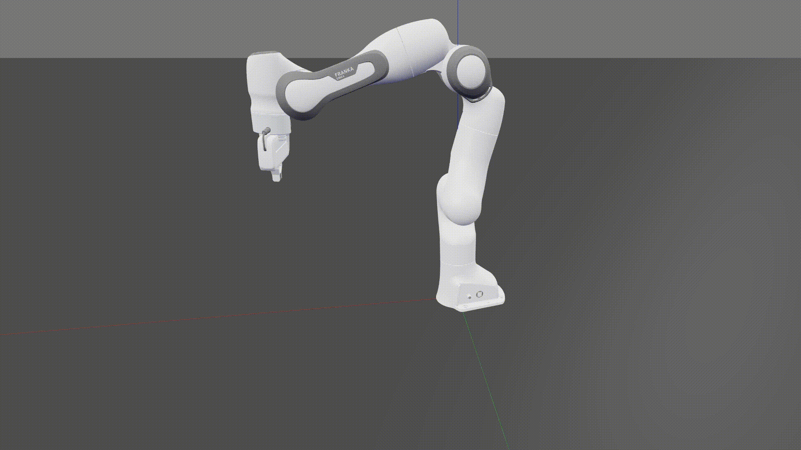

# Robotics Toolbox for Python

[](https://github.com/petercorke/robotics-toolbox-python)
[](https://qcr.github.io)

[](https://badge.fury.io/py/roboticstoolbox-python)
[](https://anaconda.org/conda-forge/roboticstoolbox-python)

[](https://opensource.org/licenses/MIT)

[](https://github.com/petercorke/robotics-toolbox-python/actions?query=workflow%3Abuild)
[](https://codecov.io/gh/petercorke/robotics-toolbox-python)
[](https://lgtm.com/projects/g/petercorke/robotics-toolbox-python/context:python)
[](https://pypistats.org/packages/roboticstoolbox-python)

<table style="border:0px">
<tr style="border:0px">
<td style="border:0px">
</td>
<td style="border:0px">
A Python implementation of the <a href="https://github.com/petercorke/robotics-toolbox-matlab">Robotics Toolbox for MATLAB<sup>&reg;</sup></a>
<ul>
<li><a href="https://github.com/petercorke/robotics-toolbox-python">GitHub repository </a></li>
<li><a href="https://petercorke.github.io/robotics-toolbox-python">Documentation</a></li>
<li><a href="#6">ICRA Paper</a></li>
<li><a href="https://github.com/petercorke/robotics-toolbox-python/wiki">Wiki (examples and details)</a></li>
</ul>
</td>
</tr>
</table>

<!-- <br> -->

## Contents

- [Synopsis](#1)
- [Getting going](#2)
- [Tutorials](#3)
- [Code Examples](#4)
- [Toolbox Research Applications](#5)
- [Toolbox ICRA Paper and Citation Info](#6)
- [Using the Toolbox in your Open Source Code?](#7)
- [Common Issues and Solutions](#8)

<br>

<a id='1'></a>

## Synopsis

This toolbox brings robotics-specific functionality to Python, and leverages
Python's advantages of portability, ubiquity and support, and the capability of
the open-source ecosystem for linear algebra (numpy, scipy), graphics
(matplotlib, three.js, WebGL), interactive development (jupyter, jupyterlab,
mybinder.org), and documentation (sphinx).

The Toolbox provides tools for representing the kinematics and dynamics of
serial-link manipulators - you can easily create your own in Denavit-Hartenberg
form, import a URDF file, or use over 30 supplied models for well-known
contemporary robots from Franka-Emika, Kinova, Universal Robotics, Rethink as
well as classical robots such as the Puma 560 and the Stanford arm.

The Toolbox contains fast implementations of kinematic operations. The forward
kinematics and the manipulator Jacobian can be computed in less than 1 microsecond
while numerical inverse kinematics can be solved in as little as 4 microseconds.

The toolbox also supports mobile robots with functions for robot motion models
(unicycle, bicycle), path planning algorithms (bug, distance transform, D\*,
PRM), kinodynamic planning (lattice, RRT), localization (EKF, particle filter),
map building (EKF) and simultaneous localization and mapping (EKF).

The Toolbox provides:

- code that is mature and provides a point of comparison for other
  implementations of the same algorithms;
- routines which are generally written in a straightforward manner which
  allows for easy understanding, perhaps at the expense of computational
  efficiency;
- source code which can be read for learning and teaching;
- backward compatability with the Robotics Toolbox for MATLAB

The Toolbox leverages the [Spatial Maths Toolbox for Python](https://github.com/petercorke/spatialmath-python) to
provide support for data types such as SO(n) and SE(n) matrices, quaternions, twists and spatial vectors.

<br>

<a id='2'></a>

## Getting going

You will need Python >= 3.6

### Using pip

Install a snapshot from PyPI

```shell script
pip3 install roboticstoolbox-python
```

Available options are:

- `collision` install collision checking with [pybullet](https://pybullet.org)

Put the options in a comma separated list like

```shell script
pip3 install roboticstoolbox-python[optionlist]
```

[Swift](https://github.com/jhavl/swift), a web-based visualizer, is
installed as part of Robotics Toolbox.

### From GitHub

To install the bleeding-edge version from GitHub

```shell script
git clone https://github.com/petercorke/robotics-toolbox-python.git
cd robotics-toolbox-python
pip3 install -e .
```

<br>

<a id='3'></a>

## Tutorials

<table style="border:0px">
<tr style="border:0px">
<td style="border:0px"><a href="https://bit.ly/3ak5GDi"></a></td>
<td style="border:0px"><a href="https://bit.ly/3ak5GDi"></a></td>
<td style="border:0px">
Do you want to learn about manipulator kinematics, differential kinematics, inverse-kinematics and motion control? Have a look at our
<a href="https://bit.ly/3ak5GDi">tutorial</a>.
This tutorial comes with two articles to cover the theory and 12 Jupyter Notebooks providing full code implementations and examples. Most of the Notebooks are also Google Colab compatible allowing them to run online.
</td>
</tr>
</table>

<br>

<a id='4'></a>

## Code Examples

We will load a model of the Franka-Emika Panda robot defined by a URDF file

```python
import roboticstoolbox as rtb
robot = rtb.models.Panda()
print(robot)

	ERobot: panda (by Franka Emika), 7 joints (RRRRRRR), 1 gripper, geometry, collision
	┌─────┬──────────────┬───────┬─────────────┬────────────────────────────────────────────────┐
	│link │     link     │ joint │   parent    │              ETS: parent to link               │
	├─────┼──────────────┼───────┼─────────────┼────────────────────────────────────────────────┤
	│   0 │ panda_link0  │       │ BASE        │                                                │
	│   1 │ panda_link1  │     0 │ panda_link0 │ SE3(0, 0, 0.333) ⊕ Rz(q0)                      │
	│   2 │ panda_link2  │     1 │ panda_link1 │ SE3(-90°, -0°, 0°) ⊕ Rz(q1)                    │
	│   3 │ panda_link3  │     2 │ panda_link2 │ SE3(0, -0.316, 0; 90°, -0°, 0°) ⊕ Rz(q2)       │
	│   4 │ panda_link4  │     3 │ panda_link3 │ SE3(0.0825, 0, 0; 90°, -0°, 0°) ⊕ Rz(q3)       │
	│   5 │ panda_link5  │     4 │ panda_link4 │ SE3(-0.0825, 0.384, 0; -90°, -0°, 0°) ⊕ Rz(q4) │
	│   6 │ panda_link6  │     5 │ panda_link5 │ SE3(90°, -0°, 0°) ⊕ Rz(q5)                     │
	│   7 │ panda_link7  │     6 │ panda_link6 │ SE3(0.088, 0, 0; 90°, -0°, 0°) ⊕ Rz(q6)        │
	│   8 │ @panda_link8 │       │ panda_link7 │ SE3(0, 0, 0.107)                               │
	└─────┴──────────────┴───────┴─────────────┴────────────────────────────────────────────────┘

	┌─────┬─────┬────────┬─────┬───────┬─────┬───────┬──────┐
	│name │ q0  │ q1     │ q2  │ q3    │ q4  │ q5    │ q6   │
	├─────┼─────┼────────┼─────┼───────┼─────┼───────┼──────┤
	│  qr │  0° │ -17.2° │  0° │ -126° │  0° │  115° │  45° │
	│  qz │  0° │  0°    │  0° │  0°   │  0° │  0°   │  0°  │
	└─────┴─────┴────────┴─────┴───────┴─────┴───────┴──────┘
```

The symbol `@` indicates the link as an end-effector, a leaf node in the rigid-body
tree (Python prompts are not shown to make it easy to copy+paste the code, console output is indented).
We will compute the forward kinematics next

```
Te = robot.fkine(robot.qr)  # forward kinematics
print(Te)

	0.995     0         0.09983   0.484
	0        -1         0         0
	0.09983   0        -0.995     0.4126
	0         0         0         1
```

We can solve inverse kinematics very easily. We first choose an SE(3) pose
defined in terms of position and orientation (end-effector z-axis down (A=-Z) and finger
orientation parallel to y-axis (O=+Y)).

```python
from spatialmath import SE3

Tep = SE3.Trans(0.6, -0.3, 0.1) * SE3.OA([0, 1, 0], [0, 0, -1])
sol = robot.ik_lm_chan(Tep)         # solve IK
print(sol)

	(array([ 0.20592815,  0.86609481, -0.79473206, -1.68254794,  0.74872915,
			2.21764746, -0.10255606]), 1, 114, 7, 2.890164057230228e-07)

q_pickup = sol[0]
print(robot.fkine(q_pickup))    # FK shows that desired end-effector pose was achieved

	 1         -8.913e-05  -0.0003334  0.5996
	-8.929e-05 -1          -0.0004912 -0.2998
	-0.0003334  0.0004912  -1          0.1001
	 0          0           0          1
```

We can animate a path from the ready pose `qr` configuration to this pickup configuration

```python
qt = rtb.jtraj(robot.qr, q_pickup, 50)
robot.plot(qt.q, backend='pyplot', movie='panda1.gif')
```

<p align="center">
	
</p>

where we have specified the matplotlib `pyplot` backend. Blue arrows show the joint axes and the coloured frame shows the end-effector pose.

We can also plot the trajectory in the Swift simulator (a browser-based 3d-simulation environment built to work with the Toolbox)

```python
robot.plot(qt.q)
```

<p align="center">
	
</p>

We can also experiment with velocity controllers in Swift. Here is a resolved-rate motion control example

```python
import swift
import roboticstoolbox as rp
import spatialmath as sm
import numpy as np

env = swift.Swift()
env.launch(realtime=True)

panda = rp.models.Panda()
panda.q = panda.qr

Tep = panda.fkine(panda.q) * sm.SE3.Trans(0.2, 0.2, 0.45)

arrived = False
env.add(panda)

dt = 0.05

while not arrived:

    v, arrived = rp.p_servo(panda.fkine(panda.q), Tep, 1)
    panda.qd = np.linalg.pinv(panda.jacobe(panda.q)) @ v
    env.step(dt)

# Uncomment to stop the browser tab from closing
# env.hold()
```

<p align="center">
	
</p>

### Run some examples

The [`notebooks`](https://github.com/petercorke/robotics-toolbox-python/tree/master/notebooks) folder contains some tutorial Jupyter notebooks which you can browse on GitHub. Additionally, have a look in the [`examples`](https://github.com/petercorke/robotics-toolbox-python/tree/master/roboticstoolbox/examples) folder for many ready to run examples.

<br>

<a id='5'></a>

## Toolbox Research Applications

The toolbox is incredibly useful for developing and prototyping algorithms for research, thanks to the exhaustive set of well documented and mature robotic functions exposed through clean and painless APIs. Additionally, the ease at which a user can visualize their algorithm supports a rapid prototyping paradigm.

### Publication List

J. Haviland, N. Sünderhauf and P. Corke, "**A Holistic Approach to Reactive Mobile Manipulation**," in _IEEE Robotics and Automation Letters_, doi: 10.1109/LRA.2022.3146554. In the video, the robot is controlled using the Robotics toolbox for Python and features a recording from the [Swift](https://github.com/jhavl/swift) Simulator.

[[Arxiv Paper](https://arxiv.org/abs/2109.04749)] [[IEEE Xplore](https://ieeexplore.ieee.org/abstract/document/9695298)] [[Project Website](https://jhavl.github.io/holistic/)] [[Video](https://youtu.be/-DXBQPeLIV4)] [[Code Example](https://github.com/petercorke/robotics-toolbox-python/blob/master/roboticstoolbox/examples/holistic_mm_non_holonomic.py)]

<p>
  <a href="https://youtu.be/-DXBQPeLIV4">
    
  </a>
</p>

J. Haviland and P. Corke, "**NEO: A Novel Expeditious Optimisation Algorithm for Reactive Motion Control of Manipulators**," in _IEEE Robotics and Automation Letters_, doi: 10.1109/LRA.2021.3056060. In the video, the robot is controlled using the Robotics toolbox for Python and features a recording from the [Swift](https://github.com/jhavl/swift) Simulator.

[[Arxiv Paper](https://arxiv.org/abs/2010.08686)] [[IEEE Xplore](https://ieeexplore.ieee.org/document/9343718)] [[Project Website](https://jhavl.github.io/neo/)] [[Video](https://youtu.be/jSLPJBr8QTY)] [[Code Example](https://github.com/petercorke/robotics-toolbox-python/blob/master/roboticstoolbox/examples/neo.py)]

<p>
  <a href="https://youtu.be/jSLPJBr8QTY">
    
  </a>
</p>

**A Purely-Reactive Manipulability-Maximising Motion Controller**, J. Haviland and P. Corke. In the video, the robot is controlled using the Robotics toolbox for Python.

[[Paper](https://arxiv.org/abs/2002.11901)] [[Project Website](https://jhavl.github.io/mmc/)] [[Video](https://youtu.be/Vu_rcPlaADI)] [[Code Example](https://github.com/petercorke/robotics-toolbox-python/blob/master/roboticstoolbox/examples/mmc.py)]

<p>
  <a href="https://youtu.be/Vu_rcPlaADI">
    
  </a>
</p>

<br>

<br>

<a id='6'></a>

## Toolbox ICRA Paper and Citation Info

Check out our ICRA 2021 paper on [IEEE Xplore](https://ieeexplore.ieee.org/document/9561366) or get the PDF from [Peter's website](https://bit.ly/icra_rtb).

If the toolbox helped you in your research, please cite

```
@inproceedings{rtb,
  title={Not your grandmother’s toolbox--the Robotics Toolbox reinvented for Python},
  author={Corke, Peter and Haviland, Jesse},
  booktitle={2021 IEEE International Conference on Robotics and Automation (ICRA)},
  pages={11357--11363},
  year={2021},
  organization={IEEE}
}
```

<br>

<a id='6'></a>

## Using the Toolbox in your Open Source Code?

If you are using the Toolbox in your open source code, feel free to add our badge to your readme!

For the powered by robotics toolbox badge

[](https://github.com/petercorke/robotics-toolbox-python)

copy the following

```
[](https://github.com/petercorke/robotics-toolbox-python)
```

For the powered by python robotics badge

[](https://github.com/petercorke/robotics-toolbox-python)

copy the following

```
[](https://github.com/petercorke/robotics-toolbox-python)
```

<br>

<a id='8'></a>

## Common Issues and Solutions

See the common issues with fixes [here](https://github.com/petercorke/robotics-toolbox-python/wiki/Common-Issues).
