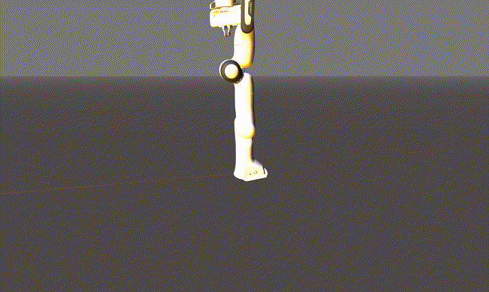

# Robotics Toolbox for Python

[](https://badge.fury.io/py/roboticstoolbox-python)

[](https://opensource.org/licenses/MIT)
[](https://mybinder.org/v2/gh/petercorke/robotics-toolbox-python/master?filepath=notebooks)
[](https://qcr.github.io)

[](https://github.com/petercorke/robotics-toolbox-python/actions?query=workflow%3Abuild)
[](https://codecov.io/gh/petercorke/robotics-toolbox-python)
[](https://lgtm.com/projects/g/petercorke/robotics-toolbox-python/context:python)
[](https://pypistats.org/packages/roboticstoolbox-python)

<table style="border:0px">
<tr style="border:0px">
<td style="border:0px">
</td>
<td style="border:0px">
A Python implementation of the <a href="https://github.com/petercorke/robotics-toolbox-matlab">Robotics Toolbox for MATLAB<sup>&reg;</sup></a>
<ul>
<li><a href="https://github.com/petercorke/robotics-toolbox-python">GitHub repository </a></li>
<li><a href="https://petercorke.github.io/robotics-toolbox-python">Documentation</a></li>
<li><a href="https://github.com/petercorke/robotics-toolbox-python/wiki">Examples and details</a></li>
</ul>
</td>
</tr>
</table>


## Synopsis

This toolbox brings robotics-specific functionality to Python, and leverages
Python's advantages of portability, ubiquity and support, and the capability of
the open-source ecosystem for linear algebra (numpy, scipy),  graphics
(matplotlib, three.js, WebGL), interactive development (jupyter, jupyterlab,
mybinder.org), and documentation (sphinx).

The Toolbox provides tools for representing the kinematics and dynamics of
serial-link manipulators  - you can easily create your own in Denavit-Hartenberg
form, import a URDF file, or use over 30 supplied models for well-known
contemporary robots from Franka-Emika, Kinova, Universal Robotics, Rethink as
well as classical robots such as the Puma 560 and the Stanford arm.

The toolbox will also support mobile robots with functions for robot motion models
(unicycle, bicycle), path planning algorithms (bug, distance transform, D*,
PRM), kinodynamic planning (lattice, RRT), localization (EKF, particle filter),
map building (EKF) and simultaneous localization and mapping (EKF).

The Toolbox provides:

  * code that is mature and provides a point of comparison for other
    implementations of the same algorithms;
  * routines which are generally written in a straightforward manner which
    allows for easy understanding, perhaps at the expense of computational
    efficiency;
  * source code which can be read for learning and teaching;
  * backward compatability with the Robotics Toolbox for MATLAB

The Toolbox leverages the [Spatial Maths Toolbox for Python](https://github.com/petercorke/spatialmath-python) to
provide support for data types such as SO(n) and SE(n) matrices, quaternions, twists and spatial vectors.
  
## Code Example

We will load a model of the Franka-Emika Panda robot defined classically using
modified (Craig's convention) Denavit-Hartenberg notation

```python
import roboticstoolbox as rtb
robot = rtb.models.DH.Panda()
print(robot)

	┏━━━━━━━━┳━━━━━━━━┳━━━━━┳━━━━━━━┳━━━━━━━━━┳━━━━━━━━┓
	┃ aⱼ₋₁   ┃  ⍺ⱼ₋₁  ┃ θⱼ  ┃  dⱼ   ┃   q⁻    ┃   q⁺   ┃
	┣━━━━━━━━╋━━━━━━━━╋━━━━━╋━━━━━━━╋━━━━━━━━━╋━━━━━━━━┫
	┃    0.0 ┃   0.0° ┃  q1 ┃ 0.333 ┃ -166.0° ┃ 166.0° ┃
	┃    0.0 ┃ -90.0° ┃  q2 ┃   0.0 ┃ -101.0° ┃ 101.0° ┃
	┃    0.0 ┃  90.0° ┃  q3 ┃ 0.316 ┃ -166.0° ┃ 166.0° ┃
	┃ 0.0825 ┃  90.0° ┃  q4 ┃   0.0 ┃ -176.0° ┃  -4.0° ┃
	┃-0.0825 ┃ -90.0° ┃  q5 ┃ 0.384 ┃ -166.0° ┃ 166.0° ┃
	┃    0.0 ┃  90.0° ┃  q6 ┃   0.0 ┃   -1.0° ┃ 215.0° ┃
	┃  0.088 ┃  90.0° ┃  q7 ┃ 0.107 ┃ -166.0° ┃ 166.0° ┃
	┗━━━━━━━━┻━━━━━━━━┻━━━━━┻━━━━━━━┻━━━━━━━━━┻━━━━━━━━┛
	
	┌─────┬───────────────────────────────────────┐
	│tool │ t = 0, 0, 0.1; rpy/xyz = -45°, 0°, 0° │
	└─────┴───────────────────────────────────────┘
	
	┌─────┬─────┬────────┬─────┬───────┬─────┬───────┬──────┐
	│name │ q0  │ q1     │ q2  │ q3    │ q4  │ q5    │ q6   │
	├─────┼─────┼────────┼─────┼───────┼─────┼───────┼──────┤
	│  qz │  0° │  0°    │  0° │  0°   │  0° │  0°   │  0°  │
	│  qr │  0° │ -17.2° │  0° │ -126° │  0° │  115° │  45° │
	└─────┴─────┴────────┴─────┴───────┴─────┴───────┴──────┘

T = robot.fkine(robot.qz)  # forward kinematics
print(T)

	   0.707107    0.707107    0           0.088        
	   0.707107   -0.707107    0           0            
	   0           0          -1           0.823        
	   0           0           0           1          
```
(Python prompts are not shown to make it easy to copy+paste the code, console output is indented)

We can solve inverse kinematics very easily.  We first choose an SE(3) pose
defined in terms of position and orientation (end-effector z-axis down (A=-Z) and finger
orientation parallel to y-axis (O=+Y)).

```python
from spatialmath import SE3

T = SE3(0.8, 0.2, 0.1) * SE3.OA([0, 1, 0], [0, 0, -1])
sol = robot.ikine_min(T)         # solve IK
print(sol.q)                     # display joint angles

	[-0.01044    7.876    1.557    -6.81    1.571    4.686   0.5169]

print(robot.fkine(sol.q))    # FK shows that desired end-effector pose was achieved

	Out[35]: 
	SE3:┏                                           ┓
		┃-1         -4e-08      0.000521   0.615    ┃
		┃ 2.79e-08   1          0.00013    0.154    ┃
		┃-0.000521   0.00013   -1          0.105    ┃
		┃ 0          0          0          1        ┃
		┗                                           ┛
```

Note that because this robot is redundant we don't have any control over the arm configuration apart from end-effector pose, ie. we can't control the elbow height.

We can animate a path from the upright `qz` configuration to this pickup configuration

```python
qt = rtb.trajectory.jtraj(robot.qz, q_pickup, 50)
robot.plot(qt.q, movie='panda1.gif')
```


which uses the default matplotlib backend.  Grey arrows show the joint axes and the colored frame shows the end-effector pose.

Let's now load a URDF model of the same robot. The kinematic representation is no longer 
based on Denavit-Hartenberg parameters, it is now a rigid-body tree.

```python
robot = rtb.models.URDF.Panda()  # load URDF version of the Panda
print(robot)    # display the model

	┌───┬──────────────┬─────────────┬──────────────┬─────────────────────────────────────────────┐
	│id │     link     │   parent    │    joint     │                     ETS                     │
	├───┼──────────────┼─────────────┼──────────────┼─────────────────────────────────────────────┤
	│ 0 │  panda_link0 │           - │              │                                             │
	│ 1 │  panda_link1 │ panda_link0 │ panda_joint1 │                          tz(0.333) * Rz(q0) │
	│ 2 │  panda_link2 │ panda_link1 │ panda_joint2 │                           Rx(-90°) * Rz(q1) │
	│ 3 │  panda_link3 │ panda_link2 │ panda_joint3 │               ty(-0.316) * Rx(90°) * Rz(q2) │
	│ 4 │  panda_link4 │ panda_link3 │ panda_joint4 │               tx(0.0825) * Rx(90°) * Rz(q3) │
	│ 5 │  panda_link5 │ panda_link4 │ panda_joint5 │ tx(-0.0825) * ty(0.384) * Rx(-90°) * Rz(q4) │
	│ 6 │  panda_link6 │ panda_link5 │ panda_joint6 │                            Rx(90°) * Rz(q5) │
	│ 7 │  panda_link7 │ panda_link6 │ panda_joint7 │                tx(0.088) * Rx(90°) * Rz(q6) │
	│ 8 │ @panda_link8 │ panda_link7 │ panda_joint8 │                                   tz(0.107) │
	└───┴──────────────┴─────────────┴──────────────┴─────────────────────────────────────────────┘
```

The symbol `@` indicates the link as an end-effector, a leaf node in the rigid-body
tree.

We can instantiate our robot inside a browser-based 3d-simulation environment.  

```python
env = rtb.backends.Swift()  # instantiate 3D browser-based visualizer
env.launch()                # activate it
env.add(robot)              # add robot to the 3D scene
for qk in qt.q:             # for each joint configuration on trajectory
      robot.q = qk          # update the robot state
      env.step()            # update visualization
```

<p align="center">
 
</p>

# Getting going

## Installing

You will need Python >= 3.6

### Using pip

Install a snapshot from PyPI

```shell script
pip3 install roboticstoolbox-python
```

Available options are:

- `vpython` install [VPython](https://vpython.org) backend
- `collision` install collision checking with [pybullet](https://pybullet.org)

Put the options in a comma separated list like

```shell script
pip3 install roboticstoolbox-python[optionlist]
```

[Swift](https://github.com/jhavl/swift), a web-based visualizer, is
installed as part of Robotics Toolbox.

### From GitHub

To install the bleeding-edge version from GitHub

```shell script
git clone https://github.com/petercorke/robotics-toolbox-python.git
cd robotics-toolbox-python
pip3 install -e .
```

## Run some examples

The [`notebooks`](https://github.com/petercorke/robotics-toolbox-python/tree/master/notebooks) folder contains some tutorial Jupyter notebooks which you can browse on GitHub.

Or you can run them, and experiment with them, at [mybinder.org](https://mybinder.org/v2/gh/petercorke/robotics-toolbox-python/master?filepath=notebooks).

## Toolbox Research Applications

The toolbox is incredibly useful for developing and prototyping algorithms for research, thanks to the exhaustive set of well documented and mature robotic functions exposed through clean and painless APIs. Additionally, the ease at which a user can visualize their algorithm supports a rapid prototyping paradigm.

### Publication List

**NEO: A Novel Expeditious Optimisation Algorithm for Reactive Motion Control of Manipulators**, J. Haviland and P. Corke. In the video, the robot is controlled using the Robotics toolbox for Python and features a recording from the [Swift](https://github.com/jhavl/swift) Simulator.

[[Paper](https://arxiv.org/abs/2010.08686)] [[Project Website](https://jhavl.github.io/neo/)] [[Video](https://youtu.be/jSLPJBr8QTY)] [[Code Example](https://github.com/petercorke/robotics-toolbox-python/blob/master/examples/neo.py)]

<p>
  <a href="https://youtu.be/jSLPJBr8QTY">
    
  </a>
</p>

**A Purely-Reactive Manipulability-Maximising Motion Controller**, J. Haviland and P. Corke. In the video, the robot is controlled using the Robotics toolbox for Python.

[[Paper](https://arxiv.org/abs/2002.11901)] [[Project Website](https://jhavl.github.io/mmc/)] [[Video](https://youtu.be/Vu_rcPlaADI)] [[Code Example](https://github.com/petercorke/robotics-toolbox-python/blob/master/examples/mmc.py)]

<p>
  <a href="https://youtu.be/Vu_rcPlaADI">
    
  </a>
</p>

<br>


