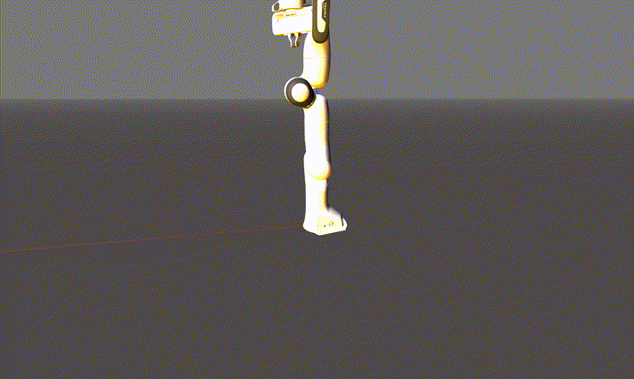
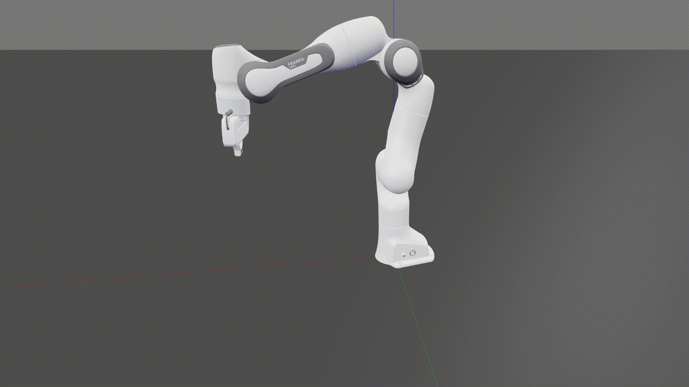

# Robotics Toolbox for Python

<div align="center">
  
  <br>
  <em>Robotics without the cruft</em>
  <br>
  <strong>A high-productivity framework for robotics research and education.</strong>
  <br><br>

[](https://petercorke.github.io/robotics-toolbox-python/lite/lab?path=robotics.ipynb)
  [](https://pypi.org/project/roboticstoolbox-python/)
  [](https://petercorke.github.io/robotics-toolbox-python)

  <p>
    <a href="https://github.com/petercorke/robotics-toolbox-python">GitHub</a> •
    <a href="https://github.com/petercorke/robotics-toolbox-python/wiki">Wiki</a> •
    <a href="https://github.com/petercorke/robotics-toolbox-python/blob/main/CHANGELOG.md">Changelog</a> •
    <a href="#getting-going">Installation</a>
  </p>
</div>

---

### Status & Ecosystem

[](https://github.com/petercorke/robotics-toolbox-python)
[](https://qcr.github.io)
[](https://github.com/petercorke/robotics-toolbox-python/actions/workflows/ci.yml)
[](https://codecov.io/gh/petercorke/robotics-toolbox-python)

[](https://opensource.org/licenses/MIT)
[](https://pypistats.org/packages/roboticstoolbox-python)
[](https://anaconda.org/conda-forge/roboticstoolbox-python)

### Powered by

[](https://github.com/petercorke/spatialmath-python)

<!-- <br> -->

## Contents

<!-- Kept as a manual list deliberately: this file is also PyPI's project
     description (see pyproject.toml's `readme`), which has no native
     table-of-contents widget the way GitHub does. Keep in sync with the
     headings below when adding/renaming a section. -->

- [Synopsis](#synopsis)
- [Getting going](#getting-going)
- [Tutorials](#tutorials)
- [Code Examples](#code-examples)
- [Toolbox Research Applications](#toolbox-research-applications)
- [References](#references)
- [Using the Toolbox in your Open Source Code?](#using-the-toolbox-in-your-open-source-code)
- [Common Issues and Solutions](#common-issues-and-solutions)
- [Build a JupyterLite/Pyodide Wasm wheel](#build-a-jupyterlitepyodide-wasm-wheel)

<br>

## Synopsis

This toolbox brings robotics-specific functionality to Python, and leverages
Python's advantages of portability, ubiquity and support, and the capability of
the open-source ecosystem for linear algebra (numpy, scipy), graphics
(matplotlib, three.js, WebGL), interactive development (Jupyter, JupyterLab,
mybinder.org), and documentation (sphinx).

The Toolbox provides tools for representing the kinematics and dynamics of
serial-link manipulators - you can easily create your own in Denavit-Hartenberg
form, import a URDF file, or use over 50 supplied models for well-known
contemporary robots from Franka-Emika, Kinova, Universal Robotics, Rethink as
well as classical robots such as the Puma 560 and the Stanford arm.

The Toolbox contains fast implementations of kinematic operations. The forward
kinematics and the manipulator Jacobian can be computed in less than 1 microsecond
while numerical inverse kinematics can be solved in as little as 4 microseconds.

The toolbox also supports mobile robots with functions for robot motion models
(unicycle, bicycle), path planning algorithms (bug, distance transform, D\*,
PRM), kinodynamic planning (lattice, RRT), localization (EKF, particle filter),
map building (EKF) and simultaneous localization and mapping (EKF).

The Toolbox provides:

- code that is mature and provides a point of comparison for other
  implementations of the same algorithms;
- routines which are generally written in a straightforward manner which
  allows for easy understanding, perhaps at the expense of computational
  efficiency;
- source code which can be read for learning and teaching;
- backward compatability with the Robotics Toolbox for MATLAB

The Toolbox leverages the [Spatial Maths Toolbox for Python](https://github.com/petercorke/spatialmath-python) to
provide support for data types such as SO(n) and SE(n) matrices, quaternions, twists and spatial vectors.

<br>

## Getting going

You will need Python >= 3.10

### Using pip

Install a snapshot from PyPI

```shell script
pip install roboticstoolbox-python
```

Available options are:

- `swift` install [Swift](https://github.com/jhavl/swift), a web-based visualizer
- `qp` install quadratic-programming IK dependencies (`qpsolvers`, `quadprog`)
- `collision` install collision checking with [coal](https://github.com/coal-library/coal) and `trimesh`
- `all` install `swift`, `qp`, and `collision`

> **Windows note:** `coal` does not publish Windows wheels on PyPI, so the
> `collision`/`all` extras skip it there and collision checking is
> unavailable via `pip` on Windows. It's available via
> `conda install -c conda-forge coal-python` if needed. Everything else in
> the Toolbox works normally.

Put the options in a comma separated list like

```shell script
pip install roboticstoolbox-python[optionlist]
```

If you want the Swift visualizer, install the `swift` extra.

Install matrix:

- Core only

```shell script
pip install roboticstoolbox-python
```

- Swift visualizer only

```shell script
pip install roboticstoolbox-python[swift]
```

- QP solver dependencies only

```shell script
pip install roboticstoolbox-python[qp]
```

- Collision checking dependencies only

```shell script
pip install roboticstoolbox-python[collision]
```

- Everything (swift + qp + collision)

```shell script
pip install roboticstoolbox-python[all]
```

- Multiple extras explicitly

```shell script
pip install roboticstoolbox-python[swift,qp,collision]
```

### From GitHub

To install the bleeding-edge version from GitHub

```shell script
git clone https://github.com/petercorke/robotics-toolbox-python.git
cd robotics-toolbox-python
pip install -e .
```

To generate a Wasm wheel that will run in the browser see the [instructions here](#build-a-jupyterlitepyodide-wasm-wheel).


## Tutorials

<table style="border:0px">
<tr style="border:0px">
<td style="border:0px"><a href="https://bit.ly/3ak5GDi"></a></td>
<td style="border:0px"><a href="https://bit.ly/3ak5GDi"></a></td>
<td style="border:0px">
Do you want to learn about manipulator kinematics, differential kinematics, inverse-kinematics and motion control? Have a look at our
<a href="https://bit.ly/3ak5GDi">tutorial</a>.
This tutorial comes with two articles to cover the theory and 12 Jupyter Notebooks providing full code implementations and examples. Most of the Notebooks are also Google Colab compatible allowing them to run online.
</td>
</tr>
</table>

<br>

## Code Examples

We will load a model of the Franka-Emika Panda robot defined by a URDF file

```python
import roboticstoolbox as rtb
robot = rtb.models.Panda()
print(robot)

	ERobot: panda (by Franka Emika), 7 joints (RRRRRRR), 1 gripper, geometry, collision
	┌─────┬──────────────┬───────┬─────────────┬────────────────────────────────────────────────┐
	│link │     link     │ joint │   parent    │              ETS: parent to link               │
	├─────┼──────────────┼───────┼─────────────┼────────────────────────────────────────────────┤
	│   0 │ panda_link0  │       │ BASE        │                                                │
	│   1 │ panda_link1  │     0 │ panda_link0 │ SE3(0, 0, 0.333) ⊕ Rz(q0)                      │
	│   2 │ panda_link2  │     1 │ panda_link1 │ SE3(-90°, -0°, 0°) ⊕ Rz(q1)                    │
	│   3 │ panda_link3  │     2 │ panda_link2 │ SE3(0, -0.316, 0; 90°, -0°, 0°) ⊕ Rz(q2)       │
	│   4 │ panda_link4  │     3 │ panda_link3 │ SE3(0.0825, 0, 0; 90°, -0°, 0°) ⊕ Rz(q3)       │
	│   5 │ panda_link5  │     4 │ panda_link4 │ SE3(-0.0825, 0.384, 0; -90°, -0°, 0°) ⊕ Rz(q4) │
	│   6 │ panda_link6  │     5 │ panda_link5 │ SE3(90°, -0°, 0°) ⊕ Rz(q5)                     │
	│   7 │ panda_link7  │     6 │ panda_link6 │ SE3(0.088, 0, 0; 90°, -0°, 0°) ⊕ Rz(q6)        │
	│   8 │ @panda_link8 │       │ panda_link7 │ SE3(0, 0, 0.107)                               │
	└─────┴──────────────┴───────┴─────────────┴────────────────────────────────────────────────┘

	┌─────┬─────┬────────┬─────┬───────┬─────┬───────┬──────┐
	│name │ q0  │ q1     │ q2  │ q3    │ q4  │ q5    │ q6   │
	├─────┼─────┼────────┼─────┼───────┼─────┼───────┼──────┤
	│  qr │  0° │ -17.2° │  0° │ -126° │  0° │  115° │  45° │
	│  qz │  0° │  0°    │  0° │  0°   │  0° │  0°   │  0°  │
	└─────┴─────┴────────┴─────┴───────┴─────┴───────┴──────┘
```

The symbol `@` indicates the link as an end-effector, a leaf node in the rigid-body
tree (Python prompts are not shown to make it easy to copy+paste the code, console output is indented).
We will compute the forward kinematics next

```
Te = robot.fkine(robot.qr)  # forward kinematics
print(Te)

	0.995     0         0.09983   0.484
	0        -1         0         0
	0.09983   0        -0.995     0.4126
	0         0         0         1
```

We can solve inverse kinematics very easily. We first choose an SE(3) pose
defined in terms of position and orientation (end-effector z-axis down (A=-Z) and finger
orientation parallel to y-axis (O=+Y)).

```python
from spatialmath import SE3

Tep = SE3.Trans(0.6, -0.3, 0.1) * SE3.OA([0, 1, 0], [0, 0, -1])
sol = robot.ik_LM(Tep)         # solve IK
print(sol)

	(array([ 0.20592815,  0.86609481, -0.79473206, -1.68254794,  0.74872915,
			2.21764746, -0.10255606]), 1, 114, 7, 2.890164057230228e-07)

q_pickup = sol[0]
print(robot.fkine(q_pickup))    # FK shows that desired end-effector pose was achieved

	 1         -8.913e-05  -0.0003334  0.5996
	-8.929e-05 -1          -0.0004912 -0.2998
	-0.0003334  0.0004912  -1          0.1001
	 0          0           0          1
```

We can animate a path from the ready pose `qr` configuration to this pickup configuration

```python
qt = rtb.jtraj(robot.qr, q_pickup, 50)
robot.plot(qt.q, backend='pyplot', movie='panda1.gif')
```

<p align="center">
	
</p>

where we have specified the matplotlib `pyplot` backend. Blue arrows show the joint axes and the coloured frame shows the end-effector pose.

We can also plot the trajectory in the Swift simulator (a browser-based 3d-simulation environment built to work with the Toolbox)

```python
robot.plot(qt.q)
```

<p align="center">
	
</p>

We can also experiment with velocity controllers in Swift. Here is a resolved-rate motion control example

```python
import swift
import roboticstoolbox as rtb
import spatialmath as sm
import numpy as np

env = swift.Swift()
env.launch(realtime=True)

panda = rtb.models.Panda()
panda.q = panda.qr

Tep = panda.fkine(panda.q) * sm.SE3.Trans(0.2, 0.2, 0.45)

arrived = False
env.add(panda)

dt = 0.05

while not arrived:

    v, arrived = rtb.p_servo(panda.fkine(panda.q), Tep, 1)
    panda.qd = np.linalg.pinv(panda.jacobe(panda.q)) @ v
    env.step(dt)

# Uncomment to stop the browser tab from closing
# env.hold()
```

<p align="center">
	
</p>

### Run some examples

The [`notebooks`](https://github.com/petercorke/robotics-toolbox-python/tree/main/notebooks) folder contains some tutorial Jupyter notebooks which you can browse on GitHub. Additionally, have a look in the [`examples`](https://github.com/petercorke/robotics-toolbox-python/tree/main/roboticstoolbox/examples) folder for many ready to run examples.

<br>

## References

### Key papers

- P. Corke, "A computer tool for simulation and analysis: the Robotics Toolbox for MATLAB," Proc. National Conf. Australian Robot Association, pp. 319–330, Melbourne, July 1995. [[PDF]](http://www.petercorke.com/RTB/ARA95.pdf)
- P. Corke, "A robotics toolbox for MATLAB," IEEE Robotics and Automation Magazine, 3(1):24–32, Sept. 1996. [[IEEE Xplore]](https://ieeexplore.ieee.org/document/486658)
- P. Corke, "A simple and systematic approach to assigning Denavit-Hartenberg parameters," IEEE Transactions on Robotics, 23(3):590–594, 2007. [[IEEE Xplore]](https://ieeexplore.ieee.org/document/4252158) — introduces the Elementary Transform Sequence (ETS) notation used throughout the Toolbox.
- J. Haviland and P. Corke, "A systematic approach to computing the manipulator Jacobian and Hessian using the elementary transform sequence," arXiv preprint, 2020. [[arXiv]](https://arxiv.org/abs/2010.08696)
- P. Corke and J. Haviland, "Not your grandmother's toolbox – the Robotics Toolbox reinvented for Python," Proc. ICRA 2021. [[IEEE Xplore]](https://ieeexplore.ieee.org/document/9561366) [[PDF]](https://bit.ly/3ChcyNp)

### Talks

- [Peter Corke – The Robotics Toolbox: 30 Years Old and Still Going Strong](https://www.youtube.com/watch?v=U37NMe7anXc&list=PL1pxneANaikCP5jwrw91UBkrCklkQXlyr&index=1) — a retrospective on the Toolbox's history and motivation, a good starting point before diving into the API.

### Related book

The Toolbox is a companion to Peter Corke's textbook [*Robotics, Vision & Control*](https://petercorke.com/books/robotics-vision-control-all-versions/) (Springer) — many docstrings and examples reference specific figures/sections from the book.

### Citing the Toolbox

If the toolbox helped you in your research, please cite

```
@inproceedings{rtb,
  title={Not your grandmother’s toolbox--the Robotics Toolbox reinvented for Python},
  author={Corke, Peter and Haviland, Jesse},
  booktitle={2021 IEEE International Conference on Robotics and Automation (ICRA)},
  pages={11357--11363},
  year={2021},
  organization={IEEE}
}
```

<br>

## Using the Toolbox in your Open Source Code?

If you are using the Toolbox in your open source code, feel free to add our badge to your readme!

For the powered by robotics toolbox badge

[](https://github.com/petercorke/robotics-toolbox-python)

copy the following

```
[](https://github.com/petercorke/robotics-toolbox-python)
```

For the powered by python robotics badge

[](https://github.com/petercorke/robotics-toolbox-python)

copy the following

```
[](https://github.com/petercorke/robotics-toolbox-python)
```

<br>

## Common Issues and Solutions

See the common issues with fixes [here](https://github.com/petercorke/robotics-toolbox-python/wiki/Common-Issues).

### Using the Toolbox with Windows?

Graphical visualisation via Swift is currently not supported under Windows. However there is a hotfix, by changing in ```SwiftRoute.py```

```self.path[9:]``` to  ```self.path[10:]```

<br>

<br>

## Toolbox Research Applications

The toolbox is incredibly useful for developing and prototyping algorithms for research, thanks to the exhaustive set of well documented and mature robotic functions exposed through clean and painless APIs. Additionally, the ease at which a user can visualize their algorithm supports a rapid prototyping paradigm.

### Publication List

J. Haviland, N. Sünderhauf and P. Corke, "**A Holistic Approach to Reactive Mobile Manipulation**," in _IEEE Robotics and Automation Letters_, doi: 10.1109/LRA.2022.3146554. In the video, the robot is controlled using the Robotics toolbox for Python and features a recording from the [Swift](https://github.com/jhavl/swift) Simulator.

[[Arxiv Paper](https://arxiv.org/abs/2109.04749)] [[IEEE Xplore](https://ieeexplore.ieee.org/abstract/document/9695298)] [[Project Website](https://jhavl.github.io/holistic/)] [[Video](https://youtu.be/-DXBQPeLIV4)] [[Code Example](https://github.com/petercorke/robotics-toolbox-python/blob/main/roboticstoolbox/examples/holistic_mm_non_holonomic.py)]

<p>
  <a href="https://youtu.be/-DXBQPeLIV4">
    
  </a>
</p>

J. Haviland and P. Corke, "**NEO: A Novel Expeditious Optimisation Algorithm for Reactive Motion Control of Manipulators**," in _IEEE Robotics and Automation Letters_, doi: 10.1109/LRA.2021.3056060. In the video, the robot is controlled using the Robotics toolbox for Python and features a recording from the [Swift](https://github.com/jhavl/swift) Simulator.

[[Arxiv Paper](https://arxiv.org/abs/2010.08686)] [[IEEE Xplore](https://ieeexplore.ieee.org/document/9343718)] [[Project Website](https://jhavl.github.io/neo/)] [[Video](https://youtu.be/jSLPJBr8QTY)] [[Code Example](https://github.com/petercorke/robotics-toolbox-python/blob/main/roboticstoolbox/examples/neo.py)]

<p>
  <a href="https://youtu.be/jSLPJBr8QTY">
    
  </a>
</p>

K. He, R. Newbury, T. Tran, J. Haviland, B. Burgess-Limerick, D. Kulić, P. Corke, A. Cosgun, "**Visibility Maximization Controller for Robotic Manipulation**", in _IEEE Robotics and Automation Letters_, doi: 10.1109/LRA.2022.3188430. In the video, the robot is controlled using the Robotics toolbox for Python and features a recording from the [Swift](https://github.com/jhavl/swift) Simulator.

[[Arxiv Paper](https://arxiv.org/abs/2202.12557)] [[IEEE Xplore](https://ieeexplore.ieee.org/abstract/document/9815144)] [[Project Website](https://rhys-newbury.github.io/projects/vmc/)] [[Video](https://youtu.be/vobLvg4E3kM)] [[Code Example](https://github.com/petercorke/robotics-toolbox-python/blob/main/roboticstoolbox/examples/fetch_vision.py)]

<p>
  <a href="https://youtu.be/vobLvg4E3kM">
    
  </a>
</p>

**A Purely-Reactive Manipulability-Maximising Motion Controller**, J. Haviland and P. Corke. In the video, the robot is controlled using the Robotics toolbox for Python.

[[Paper](https://arxiv.org/abs/2002.11901)] [[Project Website](https://jhavl.github.io/mmc/)] [[Video](https://youtu.be/Vu_rcPlaADI)] [[Code Example](https://github.com/petercorke/robotics-toolbox-python/blob/main/roboticstoolbox/examples/mmc.py)]

<p>
  <a href="https://youtu.be/Vu_rcPlaADI">
    
  </a>
</p>

<br>

## Build a JupyterLite/Pyodide Wasm wheel

[Pyodide](https://pyodide.org/) is a full CPython distribution compiled to
WebAssembly, which is what lets the "Try it Now" JupyterLite deployment above
run this toolbox entirely client-side, no server required. Each Pyodide
release embeds one specific CPython version, and a wasm wheel is tagged with
the CPython version it was built for (`cp312`, `cp313`, ...) -— a wheel only
loads if its tag matches the CPython embedded in the Pyodide runtime actually
running. JupyterLite doesn't bundle Pyodide directly either: the
`jupyterlite-pyodide-kernel` package pulls in a specific Pyodide version per
its own release, so bumping that one package can silently change which wheel
tag your deployment now needs -— this is the single sharpest edge in this
whole pipeline. This repo's live deployment currently pins
`jupyterlite-pyodide-kernel==0.6.1` (see `.github/workflows/ci.yml`), which
embeds Pyodide 0.27.6 / CPython 3.12 — hence `cp312` below.

Also note Pyodide's own version numbering changed in 2026: releases up to
`0.29.x` used an independent `0.x` scheme, but from Pyodide `314.0.0` onward
the version number tracks the embedded CPython version directly (`314` =
Python 3.14). "Current" no longer means a `0.x` version.

### Use the published wheel (recommended)

PyPI rejects the `pyodide_*` platform tag, so Wasm wheels can't be published
there -— instead, every GitHub release attaches ready-built wheels (for each
supported CPython version) as release assets. Download the one matching your
deployment's CPython version, e.g.:

```shell script
gh release download --repo petercorke/robotics-toolbox-python --pattern '*cp312*pyodide*'
```

This is exactly what `ci.yml`'s `docs-build` job does to populate the live
"Try it Now" site — most people should do this rather than building locally.

### Build locally

Only needed to test an unreleased change, or to target a different
CPython/Pyodide pin than the current release. Uses cibuildwheel's Pyodide
platform:

```shell script
make wheel-pyodide
```

Optionally pin the Pyodide runtime to match a different JupyterLite
deployment than this project's own:

```shell script
PYODIDE_VERSION=0.27.6 make wheel-pyodide
```

The target writes to `dist/` and runs `make wheel-pyodide-check`, which validates
the wheel filename contains:

- `cp312-cp312`
- `wasm32`
- `pyemscripten_<major>_<minor>` or `pyodide_<major>_<minor>`

To inspect the produced artifact path:

```shell script
ls -1 dist/*wasm32*.whl
```

### References

- [Pyodide release notes](https://github.com/pyodide/pyodide/releases) —
  confirms what CPython version a given Pyodide tag embeds, including the
  2026 versioning-scheme change.
- [jupyterlite-pyodide-kernel changelog](https://github.com/jupyterlite/pyodide-kernel/blob/main/CHANGELOG.md) —
  the authoritative source for which Pyodide version a given kernel package
  release bundles.
- [cibuildwheel Pyodide platform docs](https://cibuildwheel.pypa.io/en/stable/platforms/#pyodide-webassembly).

<br>