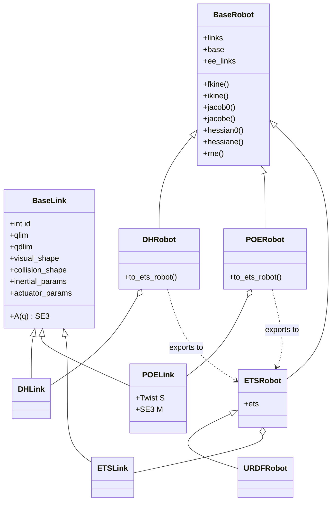
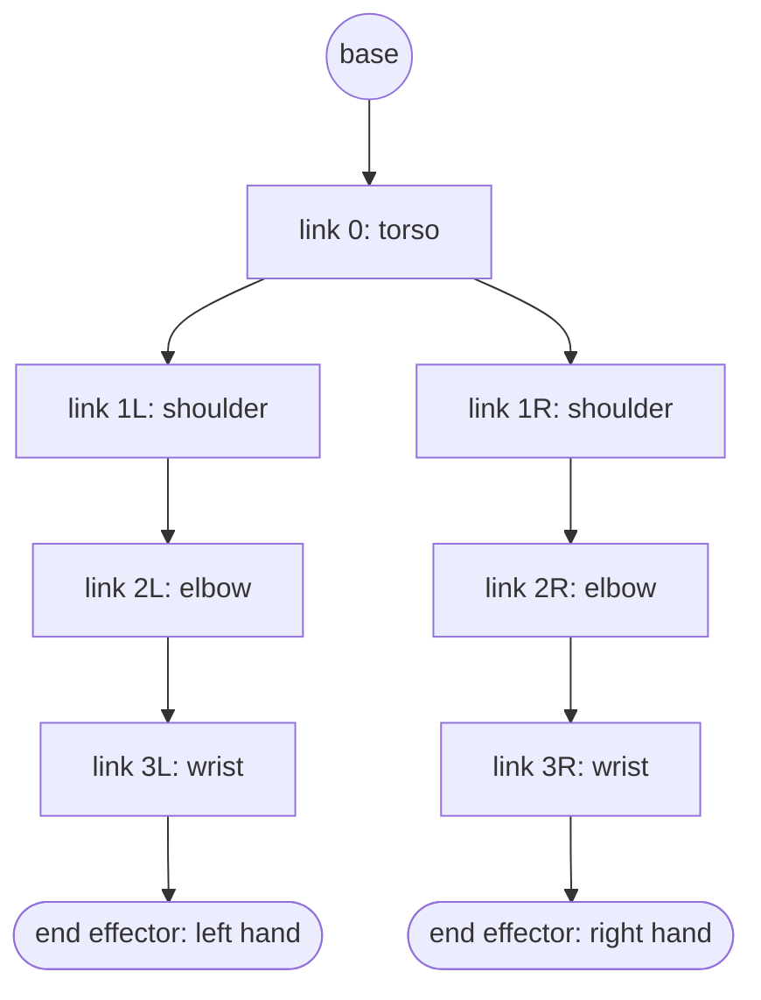
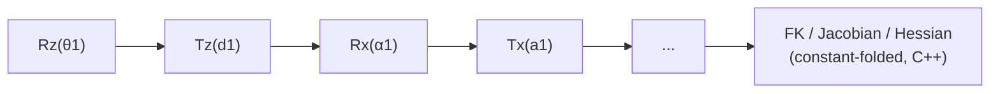

# Desiderata

The foundational concepts and principles of the Robotics Toolbox for Python (RTB-P).

**Purpose.** This document is both aspiration and guidance. It states the design the toolbox should converge on, not necessarily the design it currently has. Where the codebase diverges from a point below, that is drift to correct, not a precedent to preserve. Open questions are marked explicitly rather than silently resolved.

---

## 1. Links (`BaseLink`)

A link describes a spatial transform (2D or 3D) between two frames.

Common properties (`BaseLink`):

* holds a unique, sequential integer identifier
* the transform may be constant or parameterised by a single joint variable $q$
* implements `A(q)`, returning an `SE3` (or `SE2`) object for the transform at $q$
* the parameterisation is arbitrary: DH parameters, screws, ETs, etc.
* joint value limits
* a shape for rendering: primitive (box, sphere, ...) or mesh
* a shape for collision checking: primitive or mesh
* inertial parameters: mass, CoG, inertia tensor
* actuator parameters: motor inertia, gear ratio, motor friction (viscous + Coulomb), joint velocity limits, joint acceleration limits

### Concrete link classes: `DHLink`, `POELink`, `ETSLink`

All three:

* represent a physical rigid body
* implement `A(q)`, depending on exactly one variable which is the transformation from frame i-1 to frame i.
* support visual mesh and collision-shape attachments
* support local inertial parameters and actuator friction models

### `POELink` specifics

* parameterised by a screw axis (`Twist`) $S_i$
* stores its home pose $M_i$ and its parent's home pose $M_{i-1}$
* computes $A_i(q_i) = M_{i-1}^{-1}\, e^{S_i q_i}\, M_i$

---

## 2. Robots (`BaseRobot`)

A robot is a container for links, organised as a directed acyclic graph (DAG):

* a linear graph where nodes are in series (most industrial arms, excluding fingers), or
* a branching tree (e.g. a humanoid)
* each link has zero or one parent, and zero, one, or more children
* each link in the robot is assigned a unique sequential integer identifier

A robot:

* has a base transform: pose of the base w.r.t. the world frame
* holds a list of references to its end effectors (the DAG leaf nodes) — *resolved from the open question in the original draft: end effectors are pointers to leaf links, not separately-stored tool transforms*
* can compute:
  * forward kinematics for any leaf node (end effector)
  * inverse kinematics for a particular end effector (**stretch**: for all simultaneously)
  * Jacobian, w.r.t. an end effector or the world frame
  * Hessian, w.r.t. an end effector or the world frame
  * joint torques for arbitrary joint configuration, velocity and acceleration
  * inertia, Coriolis, and gravity-load matrices, in joint or task space
* can render/animate at varying fidelity via Matplotlib (desktop, Jupyter, JupyterLite), Swift, MeshCat, or CoppeliaSim

### Design paradigms (aspirational)

* **Symbolic-agnostic.** Mathematical routines accept NumPy floats or SymPy symbols natively, avoiding duplicate code paths. As much as possible, results should be obtainable symbolically.
* **Optimised for speed.** As much as possible, on the numeric path.
* **Pedagogy vs. speed separation.** `DHRobot` and `POERobot` stay clean, legible, pure-Python implementations for textbook tracing. Performance-critical work is offloaded by exporting to `ETSRobot`.
* **Stateless over stateful (aspiration, not yet achieved).** Structures should be immutable during runtime loops — no internal state arrays such as a persistent `.q` — with calculations taking explicit vectors and returning explicit outputs, for thread safety. The current codebase does *not* fully satisfy this (e.g. `.q` is retained for teach panels and plotting); reconciling that is a roadmap item, not a description of the present state.

---

## 3. ETS — Elementary Transform Sequences

An ETS represents a string of elementary transforms (ETs). It is a standalone kinematics object, independent of any robot.

An ET:

* describes a rotation or translation about/along a canonical axis: Rx, Ry, Rz, Tx, Ty, Tz
* has a single parameter (an angle or a translation) that may be numeric or symbolic, constant or variable
* a variable parameter may have a lower and upper bound, and a positive or negative sign

An ETS:

* describes a sequence of ETs forming a linear graph
* can be optimised by constant folding
* can compute:
  * forward kinematics, by evaluating the sequence and substituting variable values into the ETs that have one
  * Jacobian, w.r.t. the initial or final frame
  * Hessian, w.r.t. the initial or final frame
  * inverse kinematics, via numerical optimisation using FK and the Jacobian
* may use a C++-optimised backend for these computations

**An ETS is not a robot.** It deliberately excludes:

* dynamic parameters
* joint velocity/acceleration limits
* actuator parameters
* the concept of named link frames

This separation matters: ETS is pure kinematic algebra, usable on its own, and it is what makes `ETSRobot` fast — a robot's kinematics can be flattened into one optimisable ETS, stripped of everything a robot needs but an ETS doesn't.

---

## 4. Robot classes and their relationship to ETS

| Link class | Robot class | FK | Jacobian | IK | Dynamics | Exports |
|---|---|---|---|---|---|---|
| `DHLink` | `DHRobot` | sequential `.A(q)` chaining | `jacobe` from first principles, transformed for `jacob0` | generic (numerical) | classic textbook RNE | `.to_ets_robot()` |
| `POELink` | `POERobot` | sequential `.A(q)` chaining | via Adjoint maps | generic (numerical) | *(open question — not specified in either draft)* | `.to_ets_robot()` |
| `ETSLink` | `ETSRobot` | overridden, C++ | overridden, C++ | overridden, C++ (or generic) | high-speed compiled | — (this *is* the target) |

`BaseRobot` itself inherits a universal numerical `ikine`, which calls the subclass's `fkine` and `jacobian` — so any subclass gets IK "for free" by implementing FK and the Jacobian, and may override `ikine` for speed (as `ETSRobot` does).

---

## 5. Construction paths

How a user actually builds a robot:

* create a DH table and pass it to `DHRobot`
* create `DHLink` objects and pass them to `DHRobot`
* create a list of screws and a zero-configuration pose, pass to `POERobot`
* create `POELink` objects and a zero-configuration pose, pass to `POERobot`
* create an `ETS` and pass it to `ETSRobot`
* pass a URDF filename to `URDFRobot`, which constructs an `ETSRobot`

---

## Diagrams

### Class hierarchy

### DAG structure (example: two-armed / humanoid-style robot)

Each link has zero or one parent and zero-or-more children; leaf nodes are end effectors, referenced directly by the robot rather than stored as separate tool transforms.

### ETS pipeline (flattening for `ETSRobot`)

A `DHRobot` or `POERobot` exports to this representation via `.to_ets_robot()`; the sequence is then constant-folded and evaluated by the compiled backend.
