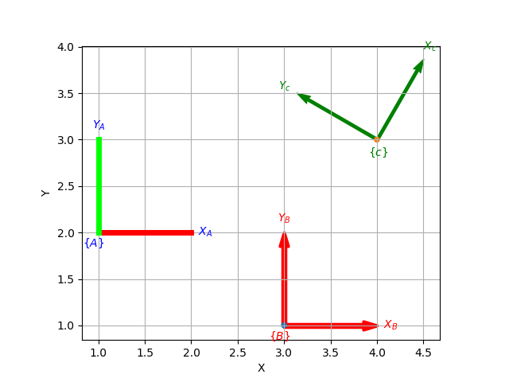

************
Introduction
************


Spatial maths capability underpins all of robotics and robotic vision by describing the relative position and orientation of objects in 2D or 3D space.  This package:

- provides Python classes and functions to manipulate matrices that represent relevant mathematical objects such as rotation matrices :math:`R \in SO(2), SO(3)`, homogeneous transformation matrices :math:`T \in SE(2), SE(3)` and quaternions :math:`q \in \mathbb{H}`.

- replicates, as much as possible, the functionality of the `Spatial Math Toolbox  <https://github.com/petercorke/spatial-math>`__ for MATLAB |reg| which underpins the `Robotics Toolbox <https://github.com/petercorke/robotics-toolbox-matlab>`__ for MATLAB. Important considerations included:

  - being as similar as possible to the MATLAB Toolbox function names and semantics
  - but balancing the tension of being as Pythonic as possible
  - use Python keyword arguments to replace the MATLAB Toolbox string options supported using `tb_optparse``
  - use ``numpy`` arrays for rotation and homogeneous transformation matrices, quaternions and vectors
  - all functions that accept a vector can accept a list, tuple, or `np.ndarray`
  - The classes can hold a sequence of elements, they are polymorphic with lists, which can be used to represent trajectories or time sequences.

Quick example:

.. code:: python

  >>> import spatialmath as sm
  >>> R = sm.SO3.Rx(30, 'deg')
  >>> R
     1         0         0          
     0         0.866025 -0.5        

which constructs a rotation about the x-axis by 30 degrees.

High-level classes
==================


These classes abstract the low-level numpy arrays into objects of class `SO2`, `SE2`, `SO3`, `SE3`, `UnitQuaternion` that obey the rules associated with the mathematical groups SO(2), SE(2), SO(3), SE(3) and
H.
Using classes has several merits:

* ensures type safety, for example it stops us mixing a 2D homogeneous transformation with a 3D rotation matrix -- both of which are 3x3 matrices.
* ensure that an SO(2), SO(3) or unit-quaternion rotation is always valid because the constraints (eg. orthogonality, unit norm) are enforced when the object is constructed.

.. code:: python

  >>> from spatialmath import *
  >>> SO2(.1)
  [[ 0.99500417 -0.09983342]
   [ 0.09983342  0.99500417]]


Type safety and type validity are particularly important when we deal with a sequence of such objects.  In robotics we frequently deal with trajectories of poses or rotation to describe objects moving in the
world.
However a list of these items has the type `list` and the elements are not enforced to be homogeneous, ie. a list could contain a mixture of classes.
Another option would be to create a `numpy` array of these objects, the upside being it could be a multi-dimensional array.  The downside is that again the array is not guaranteed to be homogeneous.


The approach adopted here is to give these classes list *super powers* so that a single `SE3` object can contain a list of SE(3) poses.  The pose objects are a list subclass so we can index it or slice it as we
would a list, but the result each time belongs to the class it was sliced from.  Here's a simple example of SE(3) but applicable to all the classes


.. code:: python

  T = transl(1,2,3) # create a 4x4 np.array

  a = SE3(T)
  len(a)
  type(a)
  a.append(a)  # append a copy
  a.append(a)  # append a copy
  type(a)
  len(a)
  a[1]  # extract one element of the list
  for x in a:
    # do a thing


These classes are all derived from two parent classes:

* `RTBPose` which provides common functionality for all
* `UserList` which provdides the ability to act like a list 


Operators for pose objects
--------------------------

Standard arithmetic operators can be applied to all these objects.

=========  ===========================
Operator      dunder method
=========  ===========================
  ``*``      **__mul__** , __rmul__
  ``*=``     __imul__
  ``/``      **__truediv__**
  ``/=``     __itruediv__
  ``**``     **__pow__**
  ``**=``    __ipow__
  ``+``      **__add__**, __radd__
  ``+=``     __iadd__
  ``-``      **__sub__**, __rsub__
  ``-=``     __isub__
=========  ===========================

This online documentation includes just the method shown in bold.
The other related methods all invoke that method.

The classes represent mathematical groups, and the rules of group are enforced.  
If this is a group operation, ie. the operands are of the same type and the operator
is the group operator, the result will be of the input type, otherwise the result
will be a matrix.

SO(n) and SE(n)
^^^^^^^^^^^^^^^

For the groups SO(n) and SE(n) the group operator is composition represented
by the multiplication operator.  The identity element is a unit matrix.

==============   ==============   ===========  ========================
           Operands                     ``*``
-------------------------------   -------------------------------------
    left             right            type           result
==============   ==============   ===========  ========================
Pose             Pose             Pose         composition [1]
Pose             scalar           matrix       elementwise product
scalar           Pose             matrix       elementwise product
Pose             N-vector         N-vector     vector transform [2]
Pose             NxM matrix       NxM matrix   vector transform [2] [3]
==============   ==============   ===========  ========================

Notes:

#. Composition is performed by standard matrix multiplication.
#. N=2 (for SO2 and SE2),  N=3 (for SO3 and SE3).
#. Matrix columns are taken as the vectors to transform.

==============   ==============   ===========  ===================
           Operands                     ``/``
-------------------------------   --------------------------------
    left             right            type           result
==============   ==============   ===========  ===================
Pose             Pose             Pose         matrix * inverse #1
Pose             scalar           matrix       elementwise product
scalar           Pose             matrix       elementwise product
==============   ==============   ===========  ===================

Notes:

#. The left operand is multiplied by the ``.inv`` property of the right operand.
   
==============   ==============   ===========  ===============================
           Operands                     ``**``
-------------------------------   --------------------------------------------
    left             right            type           result
==============   ==============   ===========  ===============================
Pose             int >= 0         Pose         exponentiation [1]
Pose             int <=0          Pose         exponentiation [1] then inverse
==============   ==============   ===========  ===============================

Notes:

#. By repeated multiplication.
   
==============   ==============   ===========  =========================
           Operands                   ``+``
-------------------------------   --------------------------------------
    left             right            type           result
==============   ==============   ===========  =========================
Pose             Pose             matrix       elementwise sum
Pose             scalar           matrix       add scalar to all elements
scalar           Pose             matrix       add scalarto all elements
==============   ==============   ===========  =========================

==============   ==============   ===========  =================================
           Operands                   ``-``
-------------------------------   ----------------------------------------------
    left             right            type           result
==============   ==============   ===========  =================================
Pose             Pose             matrix       elementwise difference
Pose             scalar           matrix       subtract scalar from all elements
scalar           Pose             matrix       subtract all elements from scalar
==============   ==============   ===========  =================================

Unit quaternions and quaternions
^^^^^^^^^^^^^^^^^^^^^^^^^^^^^^^^

Quaternions form a ring and support the operations of multiplication, addition and
subtraction. Unit quaternions form a group and the group operator is composition represented
by the multiplication operator.

==============   ==============   ==============  ======================
           Operands                   ``*``
-------------------------------   --------------------------------------
    left             right            type           result
==============   ==============   ==============  ======================
Quaternion       Quaternion       Quaternion      Hamilton product
Quaternion       UnitQuaternion   Quaternion      Hamilton product
Quaternion       scalar           Quaternion      scalar product #2
UnitQuaternion   Quaternion       Quaternion      Hamilton product
UnitQuaternion   UnitQuaternion   UnitQuaternion  Hamilton product #1
UnitQuaternion   scalar           Quaternion      scalar product #2
UnitQuaternion   3-vector         3-vector        vector rotation #3
UnitQuaternion   3xN matrix       3xN matrix      vector transform #2#3
==============   ==============   ==============  ======================

Notes:

#. Composition.
#. N=2 (for SO2 and SE2),  N=3 (for SO3 and SE3).
#. Matrix columns are taken as the vectors to transform.

==============   ==============   ==============  ================================
           Operands                   ``/``
-------------------------------   ------------------------------------------------
    left             right            type           result
==============   ==============   ==============  ================================
UnitQuaternion   UnitQuaternion   UnitQuaternion  Hamilton product with inverse #1
==============   ==============   ==============  ================================

Notes:

#. The left operand is multiplied by the ``.inv`` property of the right operand.

==============   ==============   ==============  ===============================
           Operands                     ``**``
-------------------------------   -----------------------------------------------
    left             right            type           result
==============   ==============   ==============  ===============================
Quaternion       int >= 0         Quaternion      exponentiation [1]
UnitQuaternion   int >= 0         UnitQuaternion  exponentiation [1]
UnitQuaternion   int <=0          UnitQuaternion  exponentiation [1] then inverse
==============   ==============   ==============  ===============================

Notes:

#. By repeated multiplication.

==============   ==============   ==============  ===================
           Operands                            ``+``
-------------------------------   -----------------------------------
    left             right            type           result
==============   ==============   ==============  ===================
Quaternion       Quaternion       Quaternion      elementwise sum
Quaternion       UnitQuaternion   Quaternion      elementwise sum
Quaternion       scalar           Quaternion      add to each element
UnitQuaternion   Quaternion       Quaternion      elementwise sum
UnitQuaternion   UnitQuaternion   Quaternion      elementwise sum
UnitQuaternion   scalar           Quaternion      add to each element
==============   ==============   ==============  ===================


==============   ==============   ==============  ==================================
           Operands                          ``-``
-------------------------------   --------------------------------------------------
    left             right            type           result
==============   ==============   ==============  ==================================
Quaternion       Quaternion       Quaternion      elementwise difference
Quaternion       UnitQuaternion   Quaternion      elementwise difference
Quaternion       scalar           Quaternion      subtract scalar from each element
UnitQuaternion   Quaternion       Quaternion      elementwise difference
UnitQuaternion   UnitQuaternion   Quaternion      elementwise difference
UnitQuaternion   scalar           Quaternion      subtract scalar from each element
==============   ==============   ==============  ==================================


Any other operands will raise a ``ValueError`` exception.

        
List capability
---------------

Each of these object classes has ``UserList`` as a base class which means it inherits all the functionality of
a Python list

.. code:: python

  >>> R = SO3.Rx(0.3)
  >>> len(R)
     1

.. code:: python

  >>> R = SO3.Rx(np.arange(0, 2*np.pi, 0.2)))
  >>> len(R)
    32
  >> R[0]
     1         0         0          
     0         1         0          
     0         0         1     
  >> R[-1]
     1         0         0          
     0         0.996542  0.0830894  
     0        -0.0830894 0.996542

where each item is an object of the same class as that it was extracted from.
Slice notation is also available, eg. ``R[0:-1:3]`` is a new SO3 instance containing every third element of ``R``.

In particular it includes an iterator allowing comprehensions

.. code:: python

  >>> [x.eul for x in R]
  [array([ 90.        ,   4.76616702, -90.        ]),
   array([ 90.        ,  16.22532292, -90.        ]),
   array([ 90.        ,  27.68447882, -90.        ]),
     .
     .
   array([-90.       ,  11.4591559,  90.       ]),
   array([0., 0., 0.])]


Useful functions that be used on such objects include

=============  ================================================ 
Method              Operation
=============  ================================================ 
``clear``       Clear all elements, object now has zero length
``append``      Append a single element
``del``
``enumerate``   Iterate over the elments
``extend``      Append a list of same type pose objects
``insert``      Insert an element
``len``         Return the number of elements
``map``         Map a function of each element
``pop``         Remove first element and return it
``slice``       Index from a slice object
``zip``         Iterate over the elments
=============  ================================================ 


Vectorization
-------------

For most methods, if applied to an object that contains N elements, the result will be the appropriate return object type with N elements.

Most binary operations (`*`, `*=`, `**`, `+`, `+=`, `-`, `-=`, `==`, `!=`) are vectorized.  For the case::

  Z = X op Y

the lengths of the operands and the results are given by


======   ======   ======  ========================
     operands           results
---------------   --------------------------------
len(X)   len(Y)   len(Z)     results         
======   ======   ======  ========================
  1        1        1       Z    = X op Y
  1        M        M       Z[i] = X op Y[i]
  M        1        M       Z[i] = X[i] op Y
  M        M        M       Z[i] = X[i] op Y[i]
======   ======   ======  ========================

Any other combination of lengths is not allowed and will raise a ``ValueError`` exception.   

Low-level spatial math
======================

All the classes just described abstract the ``base`` package which represent the spatial-math object as a numpy.ndarray.

The inputs to functions in this package are either floats, lists, tuples or numpy.ndarray objects describing vectors or arrays.  Functions that require a vector can be passed a list, tuple or numpy.ndarray for a vector -- described in the documentation as being of type *array_like*.

Numpy vectors are somewhat different to MATLAB, and is a gnarly aspect of numpy.  Numpy arrays have a shape described by a shape tuple which is a list of the dimensions.  Typically all ``np.ndarray`` vectors have the shape (N,), that is, they have only one dimension.  The ``@`` product of an (M,N) array and a (N,) vector is a (M,) array.  A numpy column vector has shape (N,1) and a row vector has shape (1,N) but functions also accept row (1,N)  and column (N,1) vectors.  
Iterating over a numpy.ndarray is done by row, not columns as in MATLAB.  Iterating over a 1D array (N,) returns consecutive elements, iterating a row vector (1,N) returns the entire row, iterating a column vector (N,1) returns consecutive elements (rows).

For example an SE(2) pose is represented by a 3x3 numpy array, an ndarray with shape=(3,3). A unit quaternion is 
represented by a 4-element numpy array, an ndarray with shape=(4,).

=================    ================   ===================
Spatial object       equivalent class   numpy.ndarray shape
=================    ================   ===================
2D rotation SO(2)    SO2                   (2,2)
2D pose SE(2)        SE2                   (3,3)
3D rotation SO(3)    SO3                   (3,3)
3D poseSE3 SE(3)     SE3                   (3,3)
3D rotation          UnitQuaternion        (4,)
n/a                  Quaternion            (4,)
=================    ================   ===================

Tjhe classes ``SO2``, ```SE2``, ```SO3``, ``SE3``, ``UnitQuaternion`` can operate conveniently on lists but the ``base`` functions do not support this.
If you wish to work with these functions and create lists of pose objects you could keep the numpy arrays in high-order numpy arrays (ie. add an extra dimensions),
or keep them in a list, tuple or any other python contai described in the [high-level spatial math section](#high-level-classes).

Let's show a simple example:

.. code-block:: python
   :linenos:

    >>> import spatialmath.base.transforms as base
    >>> base.rotx(0.3)
    array([[ 1.        ,  0.        ,  0.        ],
           [ 0.        ,  0.95533649, -0.29552021],
           [ 0.        ,  0.29552021,  0.95533649]])

    >>> base.rotx(30, unit='deg')
    array([[ 1.       ,  0.       ,  0.       ],
           [ 0.       ,  0.8660254, -0.5      ],
           [ 0.       ,  0.5      ,  0.8660254]])

    >>> R = base.rotx(0.3) @ base.roty(0.2)

At line 1 we import all the base functions into the namespae ``base``.
In line 12 when we multiply the matrices we need to use the `@` operator to perform matrix multiplication.  The `*` operator performs element-wise multiplication, which is equivalent to the MATLAB ``.*`` operator.

We also support multiple ways of passing vector information to functions that require it:

* as separate positional arguments

.. code:: python

  transl2(1, 2)
  array([[1., 0., 1.],
         [0., 1., 2.],
         [0., 0., 1.]])

* as a list or a tuple

.. code:: python

  transl2( [1,2] )
  array([[1., 0., 1.],
         [0., 1., 2.],
         [0., 0., 1.]])

  transl2( (1,2) )
  array([[1., 0., 1.],
         [0., 1., 2.],
         [0., 0., 1.]])


* or as a `numpy` array

.. code:: python

  transl2( np.array([1,2]) )
  array([[1., 0., 1.],
         [0., 1., 2.],
         [0., 0., 1.]])


There is a single module that deals with quaternions, regular quaternions and unit quaternions, and the representation is a `numpy` array of four elements.  As above, functions can accept the `numpy` array, a list, dict or `numpy` row or column vectors.


.. code:: python

  >>> import spatialmath.base.quaternion as quat
  >>> q = quat.qqmul([1,2,3,4], [5,6,7,8])
  >>> q
  array([-60,  12,  30,  24])
  >>> quat.qprint(q)
  -60.000000 < 12.000000, 30.000000, 24.000000 >
  >>> quat.qnorm(q)
  72.24956747275377

Functions exist to convert to and from SO(3) rotation matrices and a 3-vector representation.  The latter is often used for SLAM and bundle adjustment applications, being a minimal representation of orientation.

Graphics
--------

If ``matplotlib`` is installed then we can add 2D coordinate frames to a figure in a variety of styles:

.. code-block:: python
   :linenos:

    trplot2( transl2(1,2), frame='A', rviz=True, width=1)
    trplot2( transl2(3,1), color='red', arrow=True, width=3, frame='B')
    trplot2( transl2(4, 3)@trot2(math.pi/3), color='green', frame='c')
    plt.grid(True)



   Output of ``trplot2``

If a figure does not yet exist one is added.  If a figure exists but there is no 2D axes then one is added.  To add to an existing axes you can pass this in using the ``axes`` argument.  By default the frames are drawn with lines or arrows of unit length.  Autoscaling is enabled.

Similarly, we can plot 3D coordinate frames in a variety of styles:

.. code-block:: python
   :linenos:

    trplot( transl(1,2,3), frame='A', rviz=True, width=1, dims=[0, 10, 0, 10, 0, 10])
    trplot( transl(3,1, 2), color='red', width=3, frame='B')
    trplot( transl(4, 3, 1)@trotx(math.pi/3), color='green', frame='c', dims=[0,4,0,4,0,4])

.. figure:: ./figs/transforms3d.png
   :align: center

   Output of ``trplot``

The ``dims`` option in lines 1 and 3 sets the workspace dimensions.  Note that the last set value is what is displayed.

Depending on the backend you are using you may need to include

.. code-block:: python

    plt.show()


Symbolic support
----------------

Some functions have support for symbolic variables, for example

.. code:: python

  import sympy

  theta = sym.symbols('theta')
  print(rotx(theta))
  [[1 0 0]
   [0 cos(theta) -sin(theta)]
   [0 sin(theta) cos(theta)]]

The resulting `numpy` array is an array of symbolic objects not numbers &ndash; the constants are also symbolic objects.  You can read the elements of the matrix

.. code:: python

  >>> a = T[0,0]
  >>> a
    1
  >>> type(a)
   int

  >>> a = T[1,1]
  >>> a 
  cos(theta)
  >>> type(a)
   cos

We see that the symbolic constants are converted back to Python numeric types on read.

Similarly when we assign an element or slice of the symbolic matrix to a numeric value, they are converted to symbolic constants on the way in.

.. code:: python

  >>> T[0,3] = 22
  >>> print(T)
  [[1 0 0 22]
   [0 cos(theta) -sin(theta) 0]
   [0 sin(theta) cos(theta) 0]
   [0 0 0 1]]

but you can't write a symbolic value into a floating point matrix

.. code:: python

  >>> T = trotx(0.2)

  >>> T[0,3]=theta
  Traceback (most recent call last):
    .
    .
  TypeError: can't convert expression to float

MATLAB compatability
--------------------

We can create a MATLAB like environment by

.. code-block:: python

    from spatialmath  import *
    from spatialmath.base  import *

which has familiar functions like ``rotx`` and ``rpy2r`` available, as well as classes like ``SE3``

.. code-block:: python

  R = rotx(0.3)
  R2 = rpy2r(0.1, 0.2, 0.3)

  T = SE3(1, 2, 3)

.. |reg|    unicode:: U+000AE .. REGISTERED SIGN


