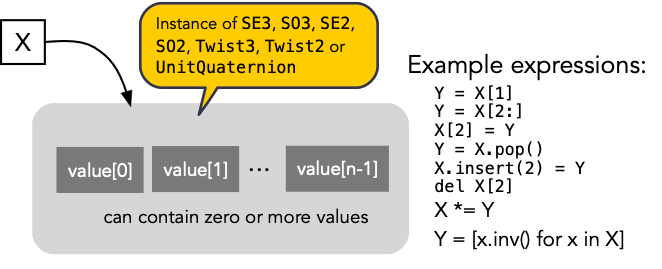
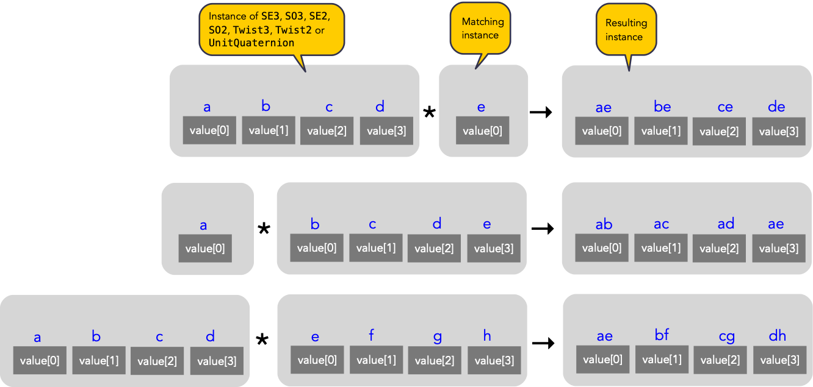
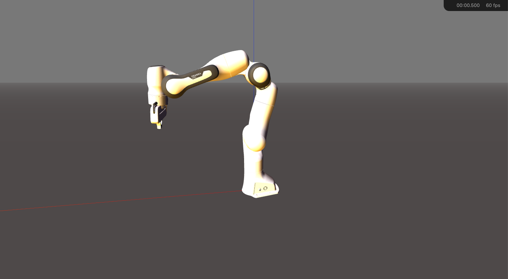
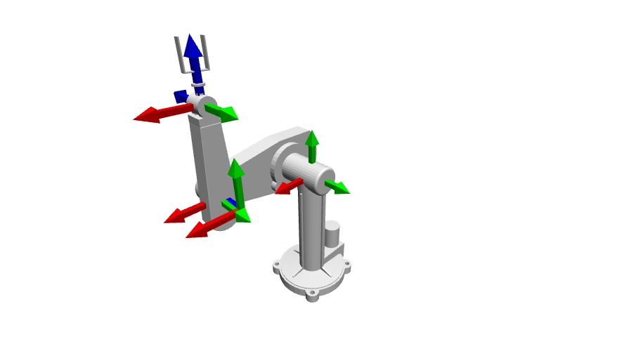

************
Introduction
************

Introduction
============

*This is a modified version of a paper submitted to ICRA2020*

The Robotics Toolbox for MATLAB® (RTB-M) was created around 1991 to support
Peter Corke’s PhD research and was first published in 1995-6 [Corke95]_
[Corke96]_. It has evolved over 25 years to track changes and improvements to
the MATLAB language and ecosystem, such as the addition of structures, objects,
lists (cell arrays) and strings, myriad of other improvements to the language,
new graphics and new tools such as IDE, debugger, notebooks (LiveScripts), apps
and continuous integration.  An adverse consequence is that many poor (in
retrospect) early design decisions hinder development. 

Over time additional functionality was added, in particular for vision, and two
major refactorings led to the current state of three toolboxes: Robotics Toolbox
for MATLAB and Machine Vision Toolbox for MATLAB (1999) both of which are built
on the Spatial Math Toolbox for MATLAB (SMTB-M) in 2019.

The code was formally open sourced to support its use for the third edition of
John Craig’s book [Craig2005]_. It was hosted on ftp sites, personal web
servers, Google code and currently GitHub and maintained under a succession of
version control tools including rcs, cvs, svn and git.  A support forum on
Google Groups was established in 2008 and as of 2020 has over 1400 members.

A Python version
================

The imperative for a Python version has long existed and the first port was
started in 2008 but ultimately failed for lack of ongoing resources to complete
a sufficient subset of functionality. Subsequent attempts have all met the same
fate.

The design goals of this version can be summarised as new functionality:

* A superset of the MATLAB Toolbox functionality
* Build on the Spatial Math Toolbox for Python [SMTB-P]_ which provides objects to
  represent rotations as SO(2) and SE(3) matrices as well as unit-quaternions;
  rigid-body motions as SE(2) and SE(3) matrices or twists in
  se(2) and se(3); and Featherstone’s spatial vectors [Featherstone87]_.
* Support models expressed using Denavit-Hartenberg notation (standard and
  modified), elementary transform sequences [Corke07]_ [Haviland20]_, and URDF-style
  rigid-body trees.  Support branched, but not closed-loop or parallel, robots
* Collision checking

and improved software engineering:

* Use Python 3 (3.6 and greater)
* Utilize WebGL and Javascript graphics technologies
* Documentation in ReStructured Text using Sphinx and delivered via GitHub pages.
* Hosted on GitHub with continuous integration using GitHub actions
* High code-quality metrics for test coverage and automated code review and security analysis
* As few dependencies as possible, in particular being able to work with ROS but not be dependent on ROS. This sidesteps ROS constraints on operating system and Python versions.
* Modular approach to interfacing to different graphics libraries, simulators and physical robots.
* Support Python notebooks which allows publication of static notebooks (for example via GitHub) and interactive online notebooks (`MyBinder.org <MyBinder.org>`_).
* Use of UniCode characters to make console output easier to read

Spatial math layer
==================

Robotics and computer vision require us to describe position, orientation and
pose in 3D space. Mobile robotics has the same requirement, but generally for 2D
space. We therefore need tools to represent quantities such as rigid-body
transformations (matrices :math:`\in \SE{n}` or twists :math:`\in \se{n}`),
rotations (matrices :math:`\in \SO{n}` or :math:`\so{n}`, Euler or roll-pitch-yaw
angles, or unit quaternions :math:`\in \mathrm{S}^3`). Such capability is amongst the oldest in
RTB-M and the equivalent functionality exists in RTB-P which makes use of the
Spatial Maths Toolbox for Python (SMTB-P) [SMTB-P]_. For example:

.. runblock:: pycon

    >>> from spatialmath.base import *
    >>> T = transl(0.5, 0.0, 0.0) @ rpy2tr(0.1, 0.2, 0.3, order='xyz') @ trotx(-90, 'deg')
    >>> print(T)

There is strong similarity to the equivalent MATLAB case apart from the use of
the ``@`` operator, the use of keyword arguments instead of keyword-value pairs,
and the format of the printed array. All the *classic* RTB-M functions are
provided in the ``spatialmath.base`` package as well as additional functions for
quaternions, vectors, twists and argument handling.  There are also functions to
perform interpolation, plot and animate coordinate frames, and create movies,
using matplotlib. The underlying datatypes in all cases are 1D and 2D NumPy
arrays. 

.. warning:: For a user transitioning from MATLAB the most significant difference is
    the use of 1D arrays -- all MATLAB arrays have two dimensions, even if one of
    them is equal to one.

However some challenges arise when using arrays, whether native MATLAB matrices
or NumPy arrays as in this case. Firstly, arrays are not typed and for example a
:math:`3 \times 3` array could be an element of :math:`\SE{2}` or
:math:`\SO{3}` or an arbitrary matrix.

Secondly, the operators we need for poses are a subset of those available for
matrices, and some operators may need to be redefined in a specific way. For
example, :math:`\SE{3} * \SE{3} \rightarrow \SE{3}` but :math:`\SE{3} + \SE{3} \rightarrow \mathbb{R}^{4 \times 4}`, and equality testing for a
unit-quaternion has to respect the double mapping.

Thirdly, in robotics we often need to represent time sequences of poses.  We
could add an extra dimension to the matrices representing rigid-body
transformations or unit-quaternions, or place them in a list.  The first
approach is cumbersome and reduces code clarity, while the second cannot ensure
that all elements of the list have the same type.

We  use classes and data encapsulation to address all these issues. SMTB-P
provides abstraction classes ``SE3``, ``Twist3``, ``SO3``, ``UnitQuaternion``,
``SE2``, ``Twist2`` and ``SO2``. For example, the previous example could be written
as:

.. runblock:: pycon
        :linenos:

        >>> from spatialmath import *
        >>> T = SE3(0.5, 0.0, 0.0) * SE3.RPY([0.1, 0.2, 0.3], order='xyz') * SE3.Rx(-90, unit='deg')
        >>> print(T)
        >>> T.eul()
        >>> T.R
        >>> T.t

where composition is denoted by the ``*`` operator and the matrix is printed more elegantly (and elements are color
coded at the console or in ipython).
``SE3.RPY()`` is a class method that acts like a constructor, creating an ``SE3`` instance from a set of roll-pitch-yaw angles,
and ``SE3.Rx()`` creates an ``SE3`` instance from a pure rotation about the x-axis.
Attempts to compose with a non ``SE3`` instance would result in a ``TypeError``.

The orientation of the new coordinate frame may be expressed in terms of Euler angles (line 9)
and components can be extracted such as the rotation submatrix (line 11) and translation (line 15).

The pose ``T`` can also be displayed as a 3D coordinate frame::

    >>> T.plot(color='red', label='2')

Rotation can also be represented by a unit quaternion

.. runblock:: pycon

    >>> from spatialmath import UnitQuaternion
    >>> print(UnitQuaternion.Rx(0.3))
    >>> print(UnitQuaternion.AngVec(0.3, [1, 0, 0]))

which again demonstrates several alternative constructors.

Multiple values
^^^^^^^^^^^^^^^

To support sequences of values each of these types inherits list properties from ``collections.UserList``

      Any of the SMTB-P pose classes can contain a list of values

We can index the values, iterate over the values, assign to values.
Some constructors take an array-like argument allowing creation of multi-valued pose objects,
for example:

.. runblock:: pycon

    >>> from spatialmath import SE3
    >>> import numpy as np
    >>> R = SE3.Rx(np.linspace(0, np.pi/2, num=100))
    >>> len(R)

where the instance ``R`` contains a sequence of 100 rotation matrices.  
Composition with a single-valued (scalar) pose instance  broadcasts the scalar
across the sequence

   Overloaded operators support broadcasting

Common constructors
^^^^^^^^^^^^^^^^^^^

The Toolboxes classes are somewhat polymorphic and share many "variant constructors" that allow object construction:

- with orientation expressed in terms of canonic axis rotations, Euler vectors, angle-vector pair,
  Euler or roll-pitch-yaw angles or orientation- and approach-vectors.
- from random values ``.Rand()``
- ``SE3``, ``SE2``, ``SO3`` and ``SO2`` also support a matrix exponential constructor where the argument is the
  corresponding Lie algebra element.
- empty, i.e. having no values or a length of 0 ``.Empty()``
- an array of ``N`` values initialized to the object's identity value ``.Alloc(N)``

Common methods and operators
^^^^^^^^^^^^^^^^^^^^^^^^^^^^

The types all have an inverse method ``.inv()`` and support composition with the inverse using the ``/`` operator
and integer exponentiation (repeated composition) using the ``**`` operator.
Other overloaded operators include ``*``, ``*=``, ``**``, ``**=``, ``/``, ``/=``, ``==``, ``!=``, ``+``, ``-``.

All of this allows for concise and readable code.
The use of classes ensures type safety and that the matrices abstracted by the class are always valid members of
the group.
Operations such as addition, which are not group operations, yield a NumPy array rather than a class instance.

Performance
^^^^^^^^^^^

These benefits come at a price in terms of execution time due to the overhead of
constructors, methods which wrap base functions, and type checking. The
Toolbox supports SymPy which provides powerful symbolic support for Python and
it works well in conjunction with NumPy, ie. a NumPy array can contain symbolic
elements.  Many the Toolbox methods and functions contain extra logic to ensure
that symbolic operations work as expected. While this adds to the overhead it
means that for the user, working with symbols is as easy as working with
numbers.  

.. table::  Performance on a 3.6GHz Intel Core i9

    ===================  ==============
    Function/method      Execution time
    ===================  ==============
    ``base.rotx()``      4.07 μs
    ``base.trotx()``     5.79 μs
    ``SE3.Rx()``         12.3 μs
    ``SE3 * SE3``        4.69 μs
    ``4x4 @``            0.986 μs
    ``SE3.inv()``        7.62 μs
    ``base.trinv()``     4.19 μs
    ``np.linalg.inv()``  4.49 μs
    ===================  ==============

Robotics Toolbox
================

Robot models
^^^^^^^^^^^^

The Toolbox ships with over 30 robot models, most of which are purely kinematic
but some have inertial and frictional parameters. Kinematic models can be
specified in a variety of ways:  standard or modified Denavit-Hartenberg (DH,
MDH) notation, as an ETS string [Corke07]_, as a rigid-body tree, or from a URDF
file.

Denavit-Hartenberg parameters
^^^^^^^^^^^^^^^^^^^^^^^^^^^^^

To specify a kinematic model using DH notation, we create a new subclass of ``DHRobot`` and pass the superclass constructor
a list of link objects.  For example, a Puma560 is simply::

    >>> robot = DHRobot(
        [
            RevoluteDH(alpha=pi/2),
            RevoluteDH(a=0.4318),
            RevoluteDH(d=0.15005, a=0.0203, alpha=-pi/2),
            RevoluteDH(d=0.4318, alpha=pi/2)
            RevoluteDH(alpha=-pi/2),
            RevoluteDH()
        ], name="Puma560")
    

where only the non-zero parameters need to be specified. In this case we used
``RevoluteDH`` objects for a revolute joint described using standard DH
conventions.  Other classes available are ``PrismaticDH``, ``RevoluteMDH`` and
``PrismaticMDH``. Other parameters such as mass,  CoG, link inertia, motor
inertia, viscous friction, Coulomb friction, and joint limits can also be
specified using additional keyword arguments.

The toolbox provides such definitions wrapped as class definitions, for example::

    class Puma560(DHRobot):

        def __init__(self):
            super().__init__(
                    [
                        RevoluteDH(alpha=pi/2),
                        RevoluteDH(a=0.4318),
                        RevoluteDH(d=0.15005, a=0.0203, alpha=-pi/2),
                        RevoluteDH(d=0.4318, alpha=pi/2)
                        RevoluteDH(alpha=-pi/2),
                        RevoluteDH()
                    ], name="Puma560"
                            )

We can now easily perform standard kinematic operations

.. runblock:: pycon
    :linenos:

    >>> import roboticstoolbox as rtb
    >>> puma = rtb.models.DH.Puma560()                  # instantiate robot model
    >>> print(puma)
    >>> print(puma.qr)
    >>> T = puma.fkine([0.1, 0.2, 0.3, 0.4, 0.5, 0.6])  # forward kinematics
    >>> print(T)
    >>> sol = puma.ikine_LM(T)                          # inverse kinematics
    >>> print(sol)

The Toolbox supports named joint configurations and these are shown in the table
at lines 16-22.

``ikine_LM`` is a generalised iterative numerical solution based on
Levenberg-Marquadt minimization, and additional status results are also
returned as part of a named tuple.

The default plot method::

    >>> puma.plot(q)

uses matplotlib to produce a "noodle robot" plot like

.. figure:: ../figs/noodle+ellipsoid.png
      :width: 600
      :alt: Puma560, with a velocity ellipsoid, rendered using the default matplotlib visualizer

      Puma560, with a velocity ellipsoid, rendered using the default matplotlib visualizer.

and we can use the mouse to rotate and zoom the plot.

.. note:: The initial joint configuration for the inverse-kinematic solution may be specified, but
    defaults to zero, and affects both the search time and the solution found, since in general
    a manipulator may have several multiple joint configurations which result in the same end-effector pose.
    For a redundant manipulator, a solution will be found but there is no
    explicit control over the null-space.  For a manipulator with :math:`n < 6` DOF 
    an additional argument is required to indicate which of the
    :math:`6-n` Cartesian DOF are to be unconstrained in the solution.

.. note:: A solution is not possible if the specified transform describes
    a point out of reach of the manipulator -- in such a case the function will
    return with an error.

The inverse kinematic procedure for most robots can 
be derived symbolically
and an efficient closed-form solution obtained.
Some provided robot models have an analytical solution coded, for example:

.. runblock:: pycon

    >>> import roboticstoolbox as rtb
    >>> puma = rtb.models.DH.Puma560()       # instantiate robot model
    >>> T = puma.fkine([0.1, 0.2, 0.3, 0.4, 0.5, 0.6])
    >>> puma.ikine_a(T, config="lun")        # analytic inverse kinematics

where we have specified a left-handed, elbow up and wrist no-flip configuration.

ETS notation
^^^^^^^^^^^^

A Puma robot can also be specified in ETS format [Corke07]_ as a sequence of simple rigid-body transformations -- pure translation
or pure rotation -- each with either a constant parameter or a free parameter which is a joint variable.

.. runblock:: pycon
    :linenos:

    >>> from roboticstoolbox import ETS as E
    >>> import roboticstoolbox as rtb
    >>> l1 = 0.672; l2 = 0.2337; l3 = 0.4318; l4 = -0.0837; l5 = 0.4318; l6 = 0.0203
    >>> e = E.tz(l1) * E.rz() * E.ty(l2) * E.ry() * E.tz(l3) * E.tx(l6) * E.ty(l4) * E.ry() * E.tz(l5) * E.rz() * E.ry() * E.rz()
    >>> print(e)
    >>> robot = rtb.ERobot(e)
    >>> print(robot)

Line 3 defines the unique lengths of the Puma robot, and line 4 defines the kinematic chain in
terms of elementary transforms.
In line 7 we pass this to the constructor for an ``ERobot`` which partitions the
elementary transform sequence into a series of links and joints -- link frames are declared
after each joint variable as well as the start and end of the sequence.
The ``ERobot`` can represent single-branched robots with any combination of revolute and prismatic joints, but
can also represent more general branched mechanisms.

ERobot: rigid-body tree and URDF import
^^^^^^^^^^^^^^^^^^^^^^^^^^^^^^^^^^^^^^^

The final approach to manipulator modeling is to an import a URDF file.  The Toolbox includes a parser with built-in xacro processor
which makes many models from the ROS universe available.

Provided models, such as for Panda or Puma, are again encapsulated as classes:

.. runblock:: pycon

    >>> import roboticstoolbox as rtb
    >>> panda = rtb.models.DH.Panda()
    >>> print(panda)
    >>> T = panda.fkine(panda.qz)
    >>> print(T)

and kinematic operations are performed using methods with the same name
as discussed above.
For branched robots, with multiple end-effectors,  the name of the frame of interest must be provided.

Some URDF models have multiple end-effectors, in which case the particular
end-effector must be specified.

.. runblock:: pycon

    >>> import roboticstoolbox as rtb
    >>> panda = rtb.models.URDF.Panda()
    >>> print(panda)
    >>> T = panda.fkine(panda.qz, endlink='panda_hand')
    >>> print(T)

In the table above we see the end-effectors indicated by @ (determined automatically
from the URDF file), so we specify one of these.  We can also specify any
other link in order to determine the pose of that link's coordinate frame.

This URDF model comes with meshes provided as Collada file which provide
detailed geometry and color.  This can be visualized using the Swift simulator:

    >>> panda.plot(qz, backend="swift")

which produces the 3-D plot 

      Panda robot rendered using the Toolbox’s Swift visualizer.

Swift is a web-based visualizer using three.js to provide high-quality 3D animations.
It can produce vivid 3D effects using anaglyphs viewed with colored glasses.
Animations can be recorded as MP4 files or animated GIF files which are useful for inclusion in GitHub markdown documents.

Trajectories
============

A joint-space trajectory for the Puma robot from its zero angle 
pose to the upright (or READY) pose in 100 steps is

.. runblock:: pycon

    >>> import roboticstoolbox as rtb
    >>> puma = rtb.models.DH.Puma560()
    >>> traj = rtb.jtraj(puma.qz, puma.qr, 100)
    >>> traj.q.shape

where ``puma.qr`` is an example of a named joint configuration.
``traj`` is named tuple with elements ``q`` = :math:`\vec{q}_k`, ``qd`` = :math:`\dvec{q}_k` and ``qdd`` = :math:`\ddvec{q}_k`.
Each element is an array with one row per time step, and each row is a joint coordinate vector.
The trajectory is a fifth order polynomial which has continuous jerk.
By default, the initial and final velocities are zero, but these may be specified by additional
arguments.

We could plot the joint coordinates as a function of time using the convenience
function::

    >>> rtb.qplot(traj.q)

Straight line (Cartesian) paths can be generated in a similar way between
two points specified by a pair of poses in :math:`\SE{3}`

.. runblock:: pycon
    :linenos:

    >>> import numpy as np
    >>> from spatialmath import SE3
    >>> import roboticstoolbox as rtb
    >>> puma = rtb.models.DH.Puma560()
    >>> t = np.arange(0, 2, 0.010)
    >>> T0 = SE3(0.6, -0.5, 0.0)
    >>> T1 = SE3(0.4, 0.5, 0.2)
    >>> Ts = rtb.tools.trajectory.ctraj(T0, T1, len(t))
    >>> len(Ts)
    >>> sol = puma.ikine_LM(Ts)                 # array of named tuples
    >>> qt = np.array([x.q for x in sol])    # convert to 2d matrix 
    >>> qt.shape

At line 9 we see that the resulting trajectory, ``Ts``, is an ``SE3`` instance with 200 values.

At line 11 we compute the inverse kinematics of each pose in the trajectory
using a single call to the ``ikine_LM`` method.
The result is a list of named tuples, which gives the IK success status for
each time step.
At line 12 we convert this into an array, with one row per time step, and each
row is a joint coordinate.
The starting 
joint coordinates for each inverse kinematic solution
is taken as the result of the solution at the previous time step.

Symbolic manipulation
=====================

As mentioned earlier, the Toolbox supports symbolic manipulation using SymPy. For example:

.. runblock:: pycon

    >>> import roboticstoolbox as rtb
    >>> import spatialmath.base as base
    >>> phi, theta, psi = base.sym.symbol('phi, theta, psi')
    >>> base.rpy2r(phi, theta, psi)

The capability extends to forward kinematics

.. runblock:: pycon
    :linenos:

    >>> import roboticstoolbox as rtb
    >>> import spatialmath.base as base
    >>> puma = rtb.models.DH.Puma560(symbolic=True)
    >>> q = base.sym.symbol("q_:6") # q = (q_1, q_2, ... q_5)
    >>> T = puma.fkine(q)
    >>> T.t[0]

If we display the value of ``puma`` we see that the :math:`\alpha_j` values are now displayed in red to indicate that they are symbolic constants.  The x-coordinate of the end-effector is
given by line 7.

SymPy allows any expression to be converted to runnable code in a variety of languages including C, Python and Octave/MATLAB.

Differential kinematics
=======================

The Toolbox computes Jacobians::

    >>> J = puma.jacob0(q)
    >>> J = puma.jacobe(q)

in the base or end-effector frames respectively, as NumPy arrays.
At a singular configuration

.. runblock:: pycon

    >>> import roboticstoolbox as rtb
    >>> puma = rtb.models.DH.Puma560()
    >>> J = puma.jacob0(puma.qr)
    >>> np.linalg.matrix_rank(J)
    >>> rtb.jsingu(J)

Jacobians can also be computed for symbolic joint variables as for forward kinematics above.

For ``ERobot`` instances we can also compute the Hessians::

    >>> H = puma.hessian0(q)
    >>> H = puma.hessiane(q)

in the base or end-effector frames respectively, as 3D NumPy arrays in :math:`\mathbb{R}^{6 \times n \times n}`.

For all robot classes we can compute manipulability

.. runblock:: pycon

    >>> import roboticstoolbox as rtb
    >>> puma = rtb.models.DH.Puma560()
    >>> m = puma.manipulability(puma.qn)
    >>> print("Yoshikawa manipulability is", m)
    >>> m = puma.manipulability(puma.qn, method="asada")
    >>> print("Asada manipulability is", m)

for the Yoshikawa and Asada measures respectively, and

.. runblock:: pycon

    >>> import roboticstoolbox as rtb
    >>> puma = rtb.models.DH.Puma560()
    >>> m = puma.manipulability(puma.qn, axes="trans")
    >>> print("Yoshikawa manipulability is", m)

is the Yoshikawa measure computed for just the task space translational degrees
of freedom.
For ``ERobot`` instances we can also compute the manipulability
Jacobian::

    >>> Jm = puma.manipm(q, J, H)

such that :math:`\dot{m} = \mat{J}_m(\vec{q}) \dvec{q}`.

Dynamics
^^^^^^^^

The Python Toolbox supports several approaches to computing dynamics.  
For models defined using standard or modified DH notation we use a classical version of the recursive Newton-Euler
algorithm implemented in Python or C.

.. note:: The same C code as used by RTB-M is called directly from Python, and does not use NumPy.

For example, the inverse dynamics

.. runblock:: pycon

    >>> import roboticstoolbox as rtb
    >>> puma = rtb.models.DH.Puma560()
    >>> tau = puma.rne(puma.qn, np.zeros((6,)), np.zeros((6,)))
    >>> print(tau)

is the gravity torque for the robot in the configuration ``qn``.

Inertia, Coriolis/centripetal and gravity terms are computed by::

    >>> puma.inertia(q)
    >>> puma.coriolis(q, qd)
    >>> puma.gravload(q)

respectively, using the method of Orin and Walker from the inverse dynamics.  These values include the effect of motor inertia and friction.

Forward dynamics are given by::

    >>> qdd = puma.accel(q, tau, qd)

We can integrate this over time by::

    >>> q = puma.fdyn(5, q0, mycontrol, ...)

which uses an RK45 numerical integration from the SciPy package to solve for the joint trajectory ``q`` given the
optional control function called as::

      tau = mycontrol(robot, t, q, qd, **args)
 
The fast C implementation is not capable of symbolic operation so a Python
version of RNE ``rne_python`` has been implemented as well.  For a 6- or 7-DoF
manipulator the torque expressions have thousands of terms yet are computed in
less than a second. However, subsequent expression manipulation is slow.

For the Puma560 robot the C version of inverse dynamics takes 23μs while the
Python version takes 1.5ms (:math:`65\times` slower).  With symbolic operands it
takes 170ms (:math:`113\times` slower) to produce the unsimplified torque
expressions.

For all robots there is also an implementation of Featherstone's spatial vector
method, ``rne_spatial()``, and SMTB-P provides a set of classes for spatial
velocity, acceleration, momentum, force and inertia.

New capability
==============

There are several areas of innovation compared to the MATLAB version of the Toolbox.

Branched mechanisms
^^^^^^^^^^^^^^^^^^^

The RTB-M ``SerialLink`` class had no option to express branching. In RTB-P the
equivalent class is ``DHRobot`` is similarly limited, but a new class ``ERobot``
is more general and allows for branching (but not closed kinematic loops). The
robot is described by a set of ``ELink`` objects, each of which points to its
parent link. The ``ERobot`` has references to the root and leaf ``ELink`` objects. This
structure closely mirrors the URDF representation, allowing for easy import of
URDF models.

Collision checking
^^^^^^^^^^^^^^^^^^

RTB-M had a simple, contributed but unsupported, collision checking capability.
This is dramatically improved in the Python version using [PyBullet]_
which supports primitive shapes such as Cylinders, Spheres and Boxes as well as
mesh objects. Every robot link can have a collision shape in addition to the shape
used for rendering.  
We can conveniently perform collision checks between links as well as between
whole robots, discrete links, and objects in the world. For example a :math:`1
\times 1 \times 1` box centered at :math:`(1,0,0)` can be tested against all, or
just one link, of the robot by::

    >>> panda = rtb.models.Panda()
    >>> obstacle = rtb.Box([1, 1, 1], SE3(1, 0, 0)) 
    >>> iscollision = panda.collided(obstacle) # boolean
    >>> iscollision = panda.links[0].collided(obstacle)

Additionally, we can compute the minimum Euclidean distance between whole
robots, discrete links, or objects.  Each distance is the length of a line
segment defined by two points in the world frame

>>> d, p1, p2 = panda.closest_point(obstacle)
>>> d, p1, p2 = panda.links[0].closest_point(obstacle)

Interfaces
^^^^^^^^^^

RTB-M could only animate a robot in a figure, and there was limited but
not-well-supported ability to interface to V-REP and a physical robot. The
Python version supports a simple, but universal API to a robot inspired by the
simplicity and expressiveness of the OpenAI Gym API which was designed as a
toolkit for developing and comparing reinforcement learning algorithms. Whether
simulating a robot or controlling a real physical robot, the API operates in the
same manner, providing users with a common interface which is not found among
other robotics packages.

By default the Toolbox behaves like the MATLAB version with a plot method::

>>> puma.plot(q)

which will plot the robot at the specified joint configurmation, or animate it if ``q`` is an :math:`m \times 6` matrix, using
the default ``PyPlot`` backend which draws a "noodle robot" using the PyPlot backend.

The more general solution, and what is implemented inside ``plot`` in the example above, is::

    >>> pyplot = roboticstoolbox.backends.PyPlot()
    >>> pyplot.launch()
    >>> pyplot.add(puma)
    >>> puma.q = q
    >>> puma.step()

This makes it possible to animate multiple robots in the one graphical window, or the one robot in various environments either graphical
or real.

      Puma560 rendered using the web-based VPython visualizer.

The VPython backend provides browser-based 3D graphics based on WebGL.  This is advantageous for displaying on mobile
devices. Still frames and animations can be recorded.

Code engineering
^^^^^^^^^^^^^^^^

The code is implemented in Python :math:`\ge 3.6` and all code is hosted on GitHub and
unit-testing is performed using GitHub-actions. Test coverage is uploaded to
``codecov.io`` for visualization and trending, and we use ``lgtm.com`` to perform
automated code review. The code is documented with ReStructured Text format
docstrings which provides powerful markup including cross-referencing,
equations, class inheritance diagrams and figures -- all of which is converted
to HTML documentation whenever a change is pushed, and this is accessible via
GitHub pages. Issues can be reported via GitHub issues or patches submitted as
pull requests.

RTB-P, and its dependencies, can be installed simply by::

    $ pip install roboticstoolbox-python

which includes basic visualization using matplotlib.
Options such as ``vpython`` can be used to specify additional dependencies to be installed.
The Toolbox adopts a "when needed" approach to many dependencies and will only attempt
to import them if the user attempts to exploit a functionality that requires it.  

If a dependency is not installed, a warning provides instructions on how to install it using ``pip``.
More details are given on the project home page.
This applies to the visualizers Vpython and Swift, as well as pybullet and ROS.
The Toolbox provides capability to import URDF-xacro files without ROS.
The backend architecture allows a user to connect to a ROS environment if required, and only then does ROS have to be
installed.

Conclusion
==========

This article has introduced and demonstrated in tutorial form the principle features of the Robotics
Toolbox for Python which runs on Mac, Windows and Linux using Python 3.6 or better.
The code is free and open, and released under the MIT licence.
It provides many of the essential tools necessary for 
robotic manipulator modelling, simulation and  control which is essential for robotics education  and research.
It is familiar yet new, and we hope it will serve the community well for the next 25 years.

Currently under development are backend interfaces for CoppeliaSim, Dynamixel
servo chains, and ROS; symbolic dynamics, simplification and code generation;
mobile robotics motion models, planners, EKF localization, map making and SLAM;
and a minimalist block-diagram simulation tool [bdsim]_.

References
==========

.. [Corke95] P. Corke. A computer tool for simulation and analysis: the Robotics Toolbox for MATLAB. In Proc. National Conf. Australian Robot Association, pages 319–330, Melbourne, July 1995.
.. [Corke96] P. Corke. A robotics toolbox for MATLAB. IEEE Robotics and Automation Magazine, 3(1):24–32, Sept. 1996.
.. [Craig2005] Introduction to Robotics, John Craig, Wiley, 2005.
.. [Featherstone87] R. Featherstone, Robot Dynamics Algorithms. Kluwer Academic, 1987.
.. [Corke07] P. Corke, `“A simple and systematic approach to assigning Denavit- Hartenberg parameters,” IEEE transactions on robotics, vol. 23, no. 3, pp. 590–594, 2007, DOI 10.1109/TRO.2007.896765. <https://ieeexplore.ieee.org/document/4252158>`_.
.. [Haviland20] `J. Haviland and P. Corke, “A systematic approach to computing the manipulator Jacobian and Hessian using the elementary transform sequence,” arXiv preprint, 2020. <https://arxiv.org/abs/2010.08696>`_
.. [PyBullet] `PyBullet <https://pybullet.org/wordpress/>`_
.. [SMTB-P] `Spatial Math Toolbox for Python <https://github.com/petercorke/spatialmath-python>`_
.. [bdsim] `Block diagram simulator for Python <https://github.com/petercorke/bdsim>`_