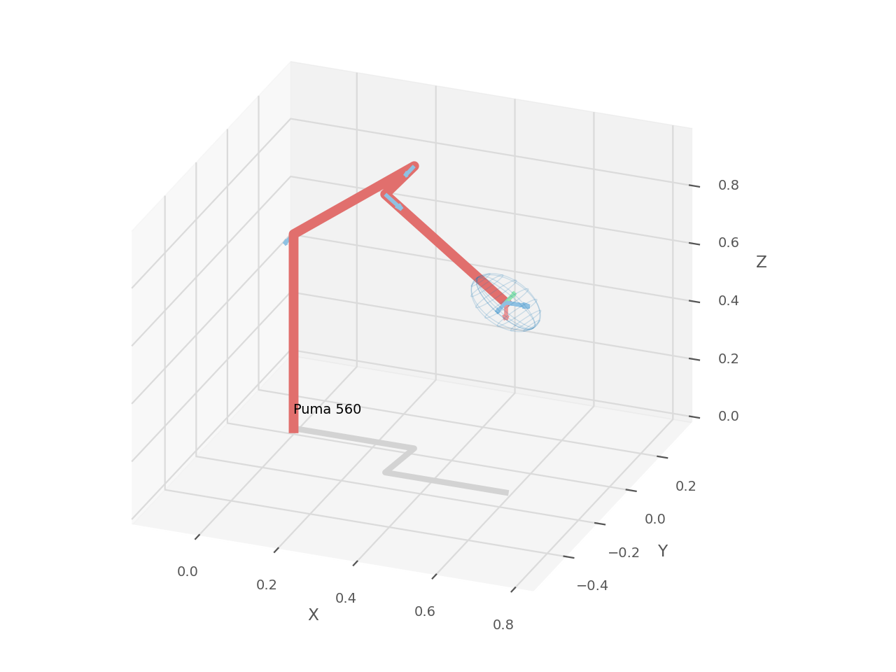
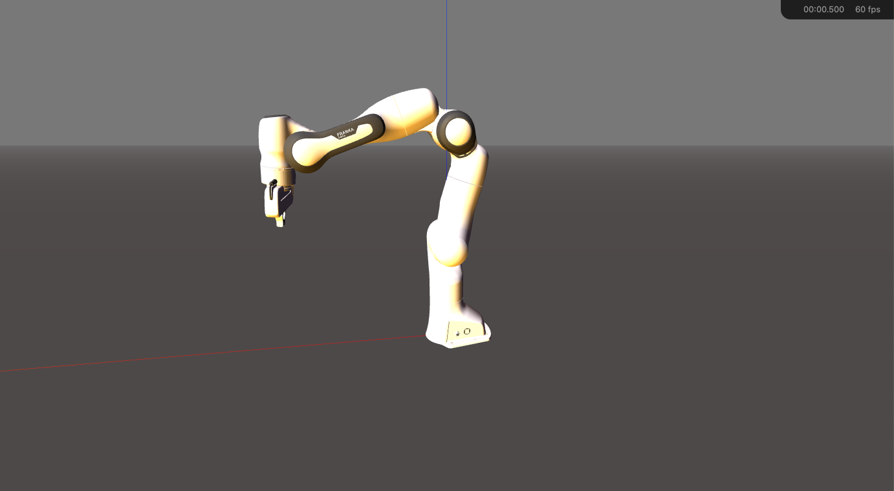
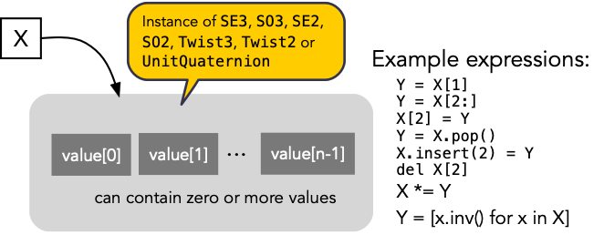
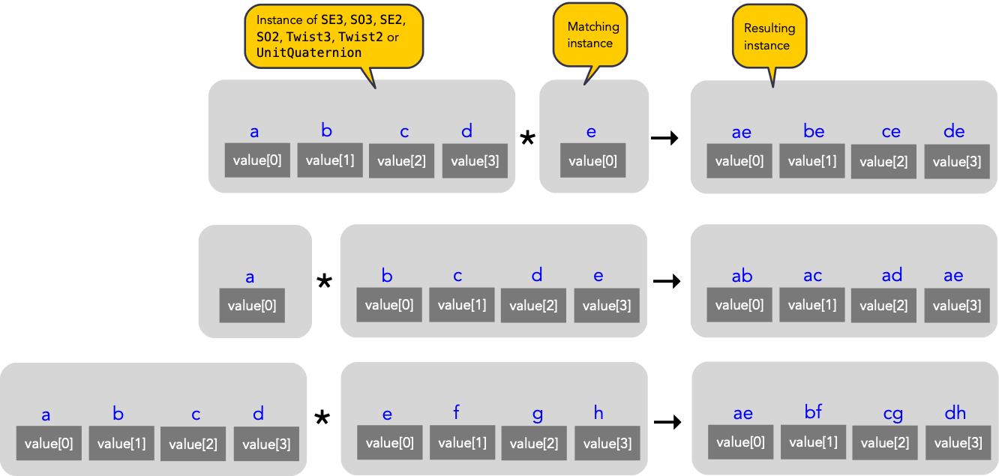

************
Introduction
************

The Robotics Toolbox for Python (RTB-P) provides tools for the kinematics,
dynamics, motion planning and control of both arm-type (serial-link
manipulator) and mobile (wheeled) robots. 

Inspired by the original Robotics Toolbox for MATLAB (RTB-M) :cite:`Corke96`, RTB-P :cite:`corke21a`
is a complete rewrite in Python, and is designed to be more modular and extensible.  It
is intended to be used in conjunction with the Spatial Math Toolbox for Python (SMTB-P)
:cite:`SMTB-P` which provides the underlying representations of pose and orientation used
throughout. The project's history, and an introduction to the
spatial-math layer, are given at the end of this document.

Arm robots
==========

Robot models
^^^^^^^^^^^^

The Toolbox ships with over 50 robot models, most of which are purely kinematic
but some have inertial and frictional parameters. Kinematic models can be
specified in a variety of ways:  standard or modified Denavit-Hartenberg (DH,
MDH) notation, as an ETS string :cite:`Corke07`, as a rigid-body tree, or from a URDF
file.

Denavit-Hartenberg parameters
^^^^^^^^^^^^^^^^^^^^^^^^^^^^^

To specify a kinematic model using DH notation, we create a new Robot instance and pass
a list of DH link objects.  For example, a Puma560 is simply::

    >>> robot = DHRobot(
    ...     [
    ...         RevoluteDH(alpha=pi/2),
    ...         RevoluteDH(a=0.4318),
    ...         RevoluteDH(d=0.15005, a=0.0203, alpha=-pi/2),
    ...         RevoluteDH(d=0.4318, alpha=pi/2),
    ...         RevoluteDH(alpha=-pi/2),
    ...         RevoluteDH()
    ...     ], name="Puma560")

where only the non-zero parameters need to be specified. In this case we used
``RevoluteDH`` objects for a revolute joint described using standard DH
conventions.  Other Link classes available are ``PrismaticDH``, ``RevoluteMDH`` and
``PrismaticMDH``. Other parameters such as mass,  CoG, link inertia, motor
inertia, viscous friction, Coulomb friction, and joint limits can also be
specified using additional keyword arguments.

The toolbox provides some such robot models wrapped as class definitions, for example the 
core logic of `models.DH.Puma560` is::

    class Puma560(DHRobot):

        def __init__(self):
            super().__init__(
                    [
                        RevoluteDH(alpha=pi/2),
                        RevoluteDH(a=0.4318),
                        RevoluteDH(d=0.15005, a=0.0203, alpha=-pi/2),
                        RevoluteDH(d=0.4318, alpha=pi/2),
                        RevoluteDH(alpha=-pi/2),
                        RevoluteDH()
                    ], name="Puma560"
                            )

We can now easily perform standard kinematic operations

.. runblock:: pycon
    :linenos:

    >>> from roboticstoolbox.models.DH import Puma560
    >>> puma = Puma560()                  # instantiate robot model
    >>> print(puma)
    >>> print(puma.qr)
    >>> T = puma.fkine([0.1, 0.2, 0.3, 0.4, 0.5, 0.6])  # forward kinematics
    >>> print(T)
    >>> sol = puma.ikine_LM(T)                          # inverse kinematics
    >>> print(sol.success)
    >>> print(sol.q)

The Toolbox supports named joint configurations and these are shown in the table at
lines 16-22.  For example, ``puma.qr`` is the upright "ready" configuration,
``puma.qz`` is the zero angle configuration, and ``puma.qn`` is a nominal elbow up table-top working configuration.

.. runblock:: pycon

    >>> from roboticstoolbox.models.DH import Puma560
    >>> puma = Puma560()                  # instantiate robot model
    >>> puma.qn

All robots can generate a random joint configuration informed by joint limits, if they exist

.. runblock:: pycon

    >>> from roboticstoolbox.models.DH import Puma560
    >>> puma = Puma560()                  # instantiate robot model
    >>> puma.random_q()

``ikine_LM`` is a generalised iterative numerical solution based on
Levenberg-Marquardt minimization, and additional status results are also
returned as part of a named tuple.  

.. warning:: 
    - The solution is not unique and the algorithm may converge to different solutions depending on the initial joint configuration. If not specified, the initial joint configuration is random.
    - The solution may also fail to converge, `sol.success` is `False`,if the specified transform is out of reach of the manipulator.

The default plot method::

    >>> puma.plot(q)

uses Matplotlib to produce a "noodle robot" plot like

      Puma560, with a velocity ellipsoid, rendered using the default Matplotlib visualizer.

and we can use the mouse to rotate and zoom the plot.

The inverse kinematic procedure for most robots can
be derived symbolically
and an efficient closed-form solution obtained.
Some provided robot models have an analytical solution coded, for example:

.. runblock:: pycon

    >>> from roboticstoolbox.models.DH import Puma560
    >>> puma = Puma560()       # instantiate robot model
    >>> T = puma.fkine([0.1, 0.2, 0.3, 0.4, 0.5, 0.6])
    >>> puma.ikine_a(T, config="lun")        # analytic inverse kinematics

where we have specified a left-handed, elbow up and wrist no-flip configuration.

ETS notation
^^^^^^^^^^^^

A Puma robot can also be specified in ETS format :cite:`Corke07` as a sequence of simple rigid-body transformations -- pure translation
or pure rotation -- each with either a constant parameter or a free parameter which is a joint variable.

.. runblock:: pycon
    :linenos:

    >>> from roboticstoolbox import ET, Robot
    >>> l1, l2, l3, l4, l5, l6 = 0.672, -0.2337, 0.4318, 0.0203, 0.0837, 0.4318 # Puma dimensions (m), see RVC2 Fig. 7.4 for details
    >>> e = ET.tz(l1) * ET.Rz() * ET.ty(l2) * ET.Ry() * ET.tz(l3) * ET.tx(l4) * ET.ty(l5) * ET.Ry() * ET.tz(l6) * ET.Rz() * ET.Ry() * ET.Rz()
    >>> print(e)
    >>> robot = Robot(e)
    >>> print(robot)

Line 2 defines the unique lengths of the Puma robot, and line 3 defines the kinematic chain in
terms of elementary transforms.  In contrast to DH notation, this description allows joint rotations about arbitrary axes and translations along arbitrary axes, and the order of the transforms is explicit.
In line 6 we pass the ETS to the constructor for a ``Robot`` which partitions the
elementary transform sequence into a series of links and joints -- link frames are declared
after each joint variable as well as the start and end of the sequence.
By explicitly creating `ETSLink` objects we can
represent general branched robot structures and also specify inertial and frictional parameters for each link.

Kinematic and plotting operations are performed using methods with the same names
as discussed above.

URDF import
^^^^^^^^^^^

The final approach to manipulator modeling is to an import a URDF file.  The Toolbox includes a parser and xacro preprocessor
which makes many models from the ROS universe available.

Provided models, such as for Panda or Puma, are again encapsulated as classes:

.. runblock:: pycon

    >>> from roboticstoolbox.models.URDF import Panda
    >>> panda = Panda()
    >>> print(panda)
    >>> T = panda.fkine(panda.qz)
    >>> print(T)

In the table above we see the end-effector indicated by @ (determined automatically
from the URDF file).
Kinematic operations and plotting operations are performed using methods with the same names
as discussed above.

Some URDF models have multiple end-effectors, for example:

.. runblock:: pycon

    >>> from roboticstoolbox.models.URDF import YuMi
    >>> yumi = YuMi()
    >>> print(yumi)

and we see two end-effectors indicated by @.  For kinematic operations we must specify one of these.  

    >>> from roboticstoolbox.models.URDF import YuMi
    >>> yumi = YuMi()
    >>> T = yumi.fkine(yumi.qz, end='gripper_r_base')
    >>> print(T)

We can also specify any
other link in order to determine the pose of that link's coordinate frame.

.. runblock:: pycon

    >>> from roboticstoolbox.models.URDF import Panda
    >>> panda = Panda()
    >>> T = panda.fkine(panda.qz, end="panda_link3")
    >>> print(T)

Most URDF models come with meshes provided as Collada file which provide
detailed geometry and color.  This can be visualized using the Swift simulator:

.. code-block:: pycon

    >>> from roboticstoolbox.models.URDF import Panda
    >>> panda = Panda()
    >>> panda.plot(panda.qz, backend="swift")

which produces the 3-D plot

      Panda robot rendered using the Toolbox’s Swift visualizer.

Swift is a web-based visualizer using three.js to provide high-quality 3D animations.
It can produce vivid 3D effects using anaglyphs viewed with colored glasses.
Animations can be recorded as MP4 files or animated GIF files which are useful for inclusion in GitHub markdown documents.

To load an arbitrary URDF or xacro file we can use::

    >>> robot = URDFRobot(filename)

which will preprocess and parse the file, and loads any associated mesh assets.

If `filename` is a plain name with no suffix, like `"ur5"`, the Toolbox will attempt to dynamically load
the model from the `robot_descriptions <https://github.com/robot-descriptions/robot_descriptions.py>`_ package, which is a collection of URDF and xacro files for many robots.
This package is installed automatically with RTB-P.

To see what's available -- both the models shipped with the Toolbox and those it can load
on demand from ``robot_descriptions`` -- use :func:`~roboticstoolbox.models.catalog.catalog`::

    >>> from roboticstoolbox.models import catalog
    >>> catalog(dof=6, mtype="URDF", sorton="name")

.. code-block:: text

    ┌─────────┬────────────┬────────────────────┬────────────┬─────┬──────┬──────────────────┬──────────┬──────────┬──────────┐
    │  class  │ robot name │    manufacturer    │ model type │ DoF │ dims │        structure │ dynamics │ geometry │ keywords │
    ├─────────┼────────────┼────────────────────┼────────────┼─────┼──────┼──────────────────┼──────────┼──────────┼──────────┤
    │ Puma560 │ Puma560    │ Unimation          │ URDF       │ 6   │ 3d   │ RRRRRR           │          │ Y        │          │
    │ UR10    │ ur10       │ Universal Robotics │ URDF       │ 6   │ 3d   │ RRRRRR           │ Y        │ Y        │          │
    │ UR3     │ ur3        │ Universal Robotics │ URDF       │ 6   │ 3d   │ RRRRRR           │ Y        │ Y        │          │
    │ UR5     │ ur5        │ Universal Robotics │ URDF       │ 6   │ 3d   │ RRRRRR           │ Y        │ Y        │          │
    └─────────┴────────────┴────────────────────┴────────────┴─────┴──────┴──────────────────┴──────────┴──────────┴──────────┘

    Importable from robot_descriptions:

    ┌─────────────────────────┬────────────┬───────────────┬────────────┬─────┬────────────────┐
    │ robot_descriptions name │ robot name │ manufacturer  │ model type │ DoF │    keywords    │
    ├─────────────────────────┼────────────┼───────────────┼────────────┼─────┼────────────────┤
    │ bolt                    │ Bolt       │ ODRI          │ URDF       │ 6   │ biped          │
    │ skydio_x2               │ Skydio X2  │ Skydio        │ URDF       │ 6   │ drone          │
    │ upkie                   │ Upkie      │ Tast's Robots │ URDF       │ 6   │ biped, wheeled │
    └─────────────────────────┴────────────┴───────────────┴────────────┴─────┴────────────────┘

This example is shown as static text rather than a live-executed block: the
``robot_descriptions`` listing runs to hundreds of rows unfiltered, and the real output
embeds a terminal hyperlink escape sequence around "robot_descriptions" that only
degrades gracefully in an interactive terminal, not in captured/static output.

The listing can be filtered by ``keywords`` or ``dof``, and sorted on ``name``, ``manufacturer``
or ``dof``. Rows in the ``robot_descriptions`` table give the name to pass to ``URDFRobot()``, e.g.
``URDFRobot("bolt")`` for the Bolt above, not the class name shown for Toolbox-wrapped models.

Trajectories
^^^^^^^^^^^^

A joint-space trajectory for the Puma robot from its zero angle
pose to the upright (or READY) pose in 100 steps is

.. runblock:: pycon

    >>> from roboticstoolbox.models.DH import Puma560
    >>> from roboticstoolbox import jtraj
    >>> puma = Puma560()
    >>> traj = jtraj(puma.qz, puma.qr, 100)
    >>> print(traj)
    >>> traj.q.shape

where ``puma.qr`` is an example of a named joint configuration.
``traj`` is named tuple with elements ``q`` = :math:`\vec{q}_k`, ``qd`` = :math:`\dvec{q}_k` and ``qdd`` = :math:`\ddvec{q}_k`.
Each element is an array with one row per time step, and each row is a joint coordinate vector.
The trajectory is a fifth order polynomial which has continuous jerk.
By default, the initial and final velocities are zero, but these may be specified by additional
arguments.

We could plot the joint coordinates and their velocities as a function of time using the convenience
function::

    >>> traj.plot()

Straight line (Cartesian) paths can be generated in a similar way between
two points specified by a pair of poses in :math:`\SE{3}`

.. runblock:: pycon
    :linenos:

    >>> import numpy as np
    >>> from spatialmath import SE3
    >>> from roboticstoolbox.models.DH import Puma560
    >>> from roboticstoolbox import ctraj
    >>> puma = Puma560()
    >>> t = np.arange(0, 2, 0.010)
    >>> T0 = SE3(0.6, -0.5, 0.3)
    >>> T1 = SE3(0.4, 0.5, 0.2)
    >>> Ts = ctraj(T0, T1, len(t))
    >>> len(Ts)
    >>> sol = puma.ikine_LM(Ts, q0=puma.qn)
    >>> sol.success
    >>> sol.q.shape

At line 9 we see that the resulting trajectory, ``Ts``, is an ``SE3`` instance
with 200 values.

At line 10 we compute the inverse kinematics of the whole trajectory in a
single call to ``ikine_LM``, seeded with the joint coordinates ``puma.qn``.
Line 11 confirms the solve converged for every pose in the sequence, and at
line 12 the per-step joint coordinates are returned as a single array, with
one row per time step.

Symbolic manipulation
^^^^^^^^^^^^^^^^^^^^^

As mentioned earlier, the Toolbox supports symbolic manipulation using SymPy. For example:

.. runblock:: pycon

    >>> import spatialmath.base as base
    >>> phi, theta, psi = base.sym.symbol('φ, ϴ, ψ')
    >>> base.rpy2r(phi, theta, psi)

The capability extends to forward kinematics

.. runblock:: pycon
    :linenos:

    >>> from roboticstoolbox.models.DH import Puma560
    >>> from spatialmath import base
    >>> puma = Puma560(symbolic=True)
    >>> q = base.sym.symbol("q_:6") # q = (q_1, q_2, ... q_5)
    >>> T = puma.fkine(q)
    >>> T.t[0]

If we display the value of ``puma`` we see that the :math:`\alpha_j` values are
now displayed in red to indicate that they are symbolic constants.  The
x-coordinate of the end-effector is given by line 6.

SymPy allows any expression to be further manipulated and simplified, and to be converted to LaTeX or a variety of languages
including C, Rust, Python and Octave/MATLAB.

Differential kinematics
^^^^^^^^^^^^^^^^^^^^^^^^

The Toolbox computes Jacobians::

    >>> J = puma.jacob0(q)
    >>> J = puma.jacobe(q)

in the base or end-effector frames respectively, as NumPy arrays.
At a singular configuration

.. runblock:: pycon

    >>> from roboticstoolbox.models.DH import Puma560
    >>> from roboticstoolbox import jsingu
    >>> puma = Puma560()
    >>> J = puma.jacob0(puma.qr)
    >>> np.linalg.matrix_rank(J)
    >>> jsingu(J)

Jacobians can also be computed for symbolic joint variables as for forward kinematics above.

For ``Robot`` instances we can also compute the Hessians::

    >>> H = puma.hessian0(q)
    >>> H = puma.hessiane(q)

in the base or end-effector frames respectively, as 3D NumPy arrays in :math:`\mathbb{R}^{6 \times n \times n}`.

For all robot classes we can compute manipulability

.. runblock:: pycon

    >>> from roboticstoolbox.models.DH import Puma560
    >>> puma = Puma560()
    >>> m = puma.manipulability(puma.qn)
    >>> print("Yoshikawa manipulability is", m)
    >>> m = puma.manipulability(puma.qn, method="asada")
    >>> print("Asada manipulability is", m)

for the Yoshikawa and Asada measures respectively, and

.. runblock:: pycon

    >>> from roboticstoolbox.models.DH import Puma560
    >>> puma = Puma560()
    >>> m = puma.manipulability(puma.qn, axes="trans")
    >>> print("Yoshikawa manipulability is", m)

is the Yoshikawa measure computed for just the task-space translational degrees
of freedom.
For ``Robot`` instances we can also compute the manipulability
Jacobian::

    >>> Jm = puma.manipm(q, J, H)

such that :math:`\dot{m} = \mat{J}_m(\vec{q}) \dvec{q}`.

Dynamics
^^^^^^^^

The Python Toolbox supports several approaches to computing dynamics.
For models defined using standard- or modified-DH notation we use a classical version of the recursive Newton-Euler
algorithm implemented in Python or C.

.. note:: The same C code as used by RTB-M is called directly from Python, and does not use NumPy.

For example, the inverse dynamics

.. runblock:: pycon

    >>> from roboticstoolbox.models.DH import Puma560
    >>> puma = Puma560()
    >>> tau = puma.rne(puma.qn, np.zeros((6,)), np.zeros((6,)))
    >>> print(tau)

is the gravity torque for the robot in the configuration ``qn``.

Inertia, Coriolis/centripetal and gravity terms are computed by::

    >>> puma.inertia(q)
    >>> puma.coriolis(q, qd)
    >>> puma.gravload(q)

respectively, using the method of Orin and Walker from the inverse dynamics.  These values include the effect of motor inertia and friction.

Forward dynamics are given by::

    >>> qdd = puma.accel(q, tau, qd)

We can integrate this over time by::

    >>> q = puma.fdyn(5, q0, mycontrol, ...)

which uses an RK45 numerical integration from the SciPy package to solve for the joint trajectory ``q`` given the
optional control function called as::

      tau = mycontrol(robot, t, q, qd, **args)

The fast C implementation is not capable of symbolic operation so a Python
version of RNE acts as a fallback.  For a 6- or 7-DoF
manipulator the torque expressions have thousands of terms yet are computed in
less than a second. However, subsequent expression manipulation is slow.

For the Puma560 robot the C version of inverse dynamics takes 23μs while the
Python version takes 1.5ms (:math:`65\times` slower).  With symbolic operands it
takes 170ms (:math:`113\times` slower) to produce the unsimplified torque
expressions.

For ``Robot`` subclasses there is also an implementation of Featherstone's spatial vector
method, ``rne()``, and SMTB-P provides a set of classes for spatial
velocity, acceleration, momentum, force and inertia.

Collision checking
^^^^^^^^^^^^^^^^^^

The Toolbox supports collision checking using the Python version using :cite:`coal`, the actively
maintained successor to FCL/hpp-fcl, which performs GJK/EPA-based distance and
collision queries against primitive shapes such as Cylinders, Spheres and Boxes
as well as mesh objects. Every robot link can have a collision shape in addition
to the shape used for rendering.

.. note:: ``coal`` publishes wheels for Linux and macOS; on Windows it is
    installable via conda-forge (``conda install -c conda-forge coal-python``)
    but not via pip, so collision checking is unavailable on a plain
    ``pip install`` on Windows.

We can conveniently perform collision checks between links as well as between
whole robots, discrete links, and objects in the world. For example a :math:`1
\times 1 \times 1` box centered at :math:`(1,0,0)` can be tested against all, or
just one link, of the robot by::

    >>> panda = Panda()
    >>> obstacle = Cuboid([1, 1, 1], pose = SE3(1, 0, 0))
    >>> iscollision = panda.iscollided(panda.q, obstacle) # boolean
    >>> iscollision = panda.links[0].iscollided(obstacle)

Additionally, we can compute the minimum Euclidean distance between whole
robots, discrete links, or objects.  Each distance is the length of a line
segment defined by two points in the world frame::

    >>> d, p1, p2 = panda.closest_point(obstacle)
    >>> d, p1, p2 = panda.links[0].closest_point(obstacle)

Mobile robots
=============

The Toolbox also supports kinematic modeling, path planning and state
estimation for wheeled mobile robots, covering vehicle motion models,
waypoint/random-path driving, a variety of planners operating over different kinds of maps, and an Extended Kalman Filter (EKF) capable of dead-reckoning
localization, map-based localization, map making, or full Simultaneous
Localization and Mapping (SLAM). See the :doc:`mobile` reference pages for
the complete set of vehicle models, drivers, planners and estimators.

Vehicle models
^^^^^^^^^^^^^^

Wheeled vehicles are modeled using kinematic motion models such as the
bicycle (car-like, Ackermann-steered) model used below, as well as unicycle
and differential-steer models.

.. runblock:: pycon

    >>> from roboticstoolbox import Bicycle
    >>> bike = Bicycle()
    >>> print(bike)

The vehicle can be driven by attaching a *driver* agent -- for example one
that steers toward a sequence of random waypoints within the workspace --
and then simulated for a number of seconds

.. runblock:: pycon
    :linenos:

    >>> from roboticstoolbox import Bicycle, RandomPath
    >>> bike = Bicycle(L=1) # wheelbase 1m
    >>> bike.control = RandomPath(workspace=10, seed=0)
    >>> _ = bike.run(T=5, animate=False)
    >>> bike.x_hist.shape

At line 4 the vehicle is driven for 5 seconds, and at line 5 we see that its
pose history, ``x_hist``, is an array with 50 rows (one per simulation time
step) and 3 columns (:math:`x`, :math:`y`, :math:`\theta`).

Path planning
^^^^^^^^^^^^^

For navigation among obstacles, the Toolbox provides a variety of planners
which operate over an occupancy grid, for example a distance-transform
planner

.. runblock:: pycon
    :linenos:

    >>> import numpy as np
    >>> from roboticstoolbox import DistanceTransformPlanner
    >>> occgrid = np.zeros((10, 10))
    >>> occgrid[3:7, 5] = 1   # a wall-like obstacle
    >>> dx = DistanceTransformPlanner(occgrid=occgrid, goal=(8, 8))
    >>> dx.plan()
    >>> path = dx.query(start=(1, 1))
    >>> path.shape

At line 7 a path is planned from the start to the goal cell, and its shape at
line 8 shows one row per waypoint. Other planners include ``Dstar``, ``PRM``,
``Lattice``, ``Dubins``, ``ReedsShepp``, ``CurvaturePoly`` and ``QuinticPoly``,
which trade off computation time, path optimality, and vehicle kinematic
constraints in different ways.

Localization
^^^^^^^^^^^^

The Toolbox implements an Extended Kalman Filter (EKF) which, depending on
which combination of vehicle, sensor and landmark map is provided, solves
dead-reckoning localization, map-based localization, map making, or full
SLAM.

For dead-reckoning localization, only a noisy vehicle motion model is needed

.. runblock:: pycon
    :linenos:

    >>> import numpy as np
    >>> from roboticstoolbox import Bicycle, RandomPath, EKF
    >>> V = np.diag([0.02, np.radians(0.5)]) ** 2
    >>> robot = Bicycle(covar=V, animation=None, workspace=10)
    >>> robot.control = RandomPath(workspace=robot, seed=0)
    >>> ekf = EKF(robot=(robot, V), P0=np.diag([0.05, 0.05, np.radians(0.5)]) ** 2)
    >>> ekf.run(T=20)
    >>> ekf.history[-1].xest

Line 6 seeds the EKF with an estimate of the odometry noise covariance ``V``
and an initial state covariance ``P0``, line 7 runs the filter for 20 seconds,
and line 8 shows the final estimated pose. Providing a range-bearing
``sensor`` and a ``map`` of known landmarks additionally enables map-based
localization; omitting the map instead performs SLAM, estimating both the
vehicle pose and the landmark positions concurrently.

Interfaces and software engineering
====================================

RTB-M could only animate a robot in a figure, and there was limited but
not-well-supported ability to interface to V-REP and a physical robot. The
Python version supports a simple, but universal API to a robot inspired by the
simplicity and expressiveness of the OpenAI Gym API which was designed as a
toolkit for developing and comparing reinforcement learning algorithms. Whether
simulating a robot or controlling a real physical robot, the API operates in the
same manner, providing users with a common interface which is not found among
other robotics packages.

By default the Toolbox behaves like the MATLAB version with a plot method::

    >>> puma.plot(q)

which will plot the robot at the specified joint configurmation, or animate it if ``q`` is an :math:`m \times 6` matrix, using
the default ``PyPlot`` backend which draws a "noodle robot" using the PyPlot backend.

The more general solution, and what is implemented inside ``plot`` in the example above, is::

    >>> pyplot = roboticstoolbox.backends.PyPlot()
    >>> pyplot.launch()
    >>> pyplot.add(puma)
    >>> puma.q = q
    >>> puma.step()

This makes it possible to animate multiple robots in the one graphical window, or the one robot in various environments either graphical
or real.

The code is implemented in Python, currently supporting versions 3.10 and higher. Type hinting is been added throughout the codebase
using modern (PEP604) Python type hints. Code coverage The code is hosted on GitHub and
unit-testing for Mac, Linux and Windows over all supported Python versions is performed using GitHub-actions. Test coverage, currently over 70%, is uploaded to
``codecov.io`` for visualization and trending. The code is documented with ReStructured Text format
docstrings which provides powerful markup including cross-referencing,
equations, class inheritance diagrams and figures -- all of which is converted
to HTML documentation whenever a change is pushed, and this is accessible via
GitHub pages. Issues can be reported via GitHub issues or patches submitted as
pull requests.

The Toolbox adopts a "when needed" approach to many dependencies and will only attempt
to import them if the user attempts to exploit a functionality that requires it.
If a dependency is not installed, a warning provides instructions on how to install it using ``pip``.

C/C++ extensions are provided for recursive Newton-Euler dynamics and optimized forward and inverse kinematics for ETS defined robots.  These
wheels are built by the GitHub CI actions.  A pure-Python wheel (using tested pure-Python fallbacks for the C/C++ functionality) is also built for use in the browser via Pyodide/JupyterLite, and is published to PyPI alongside the compiled wheels.

Spatial math layer
===================

Robotics and computer vision require us to describe position, orientation and
pose in 3D space. Mobile robotics has the same requirement, but generally for 2D
space. We therefore need tools to represent quantities such as rigid-body
transformations (matrices :math:`\in \SE{n}` or twists :math:`\in \se{n}`),
rotations (matrices :math:`\in \SO{n}` or :math:`\so{n}`, Euler or roll-pitch-yaw
angles, or unit quaternions :math:`\in \mathrm{S}^3`). Such capability is amongst the oldest in
RTB-M and the equivalent functionality exists in RTB-P which makes use of the
Spatial Maths Toolbox for Python (SMTB-P) :cite:`SMTB-P`. For example:

.. runblock:: pycon

    >>> from spatialmath.base import *
    >>> T = transl(0.5, 0.0, 0.0) @ rpy2tr(0.1, 0.2, 0.3, order='xyz') @ trotx(-90, 'deg')
    >>> print(T)

There is strong similarity to the equivalent MATLAB case apart from the use of
the ``@`` operator, the use of keyword arguments instead of keyword-value pairs,
and the format of the printed array. All the *classic* RTB-M functions are
provided in the ``spatialmath.base`` package as well as additional functions for
quaternions, vectors, twists and argument handling.  There are also functions to
perform interpolation, plot and animate coordinate frames, and create movies,
using Matplotlib. The underlying datatypes in all cases are 1D and 2D NumPy
arrays.

.. warning:: For a user transitioning from MATLAB the most significant difference is
    the use of 1D arrays -- all MATLAB arrays have two dimensions, even if one of
    them is equal to one.

However some challenges arise when using arrays, whether native MATLAB matrices
or NumPy arrays as in this case. Firstly, arrays are not typed and for example a
:math:`3 \times 3` array could be an element of :math:`\SE{2}` or
:math:`\SO{3}` or an arbitrary matrix.

Secondly, the operators we need for poses are a subset of those available for
matrices, and some operators may need to be redefined in a specific way. For
example, :math:`\SE{3} * \SE{3} \rightarrow \SE{3}` but :math:`\SE{3} + \SE{3} \rightarrow \mathbb{R}^{4 \times 4}`, and equality testing for a
unit-quaternion has to respect the double mapping.

Thirdly, in robotics we often need to represent time sequences of poses.  We
could add an extra dimension to the matrices representing rigid-body
transformations or unit-quaternions, or place them in a list.  The first
approach is cumbersome and reduces code clarity, while the second cannot ensure
that all elements of the list have the same type.

We  use classes and data encapsulation to address all these issues. SMTB-P
provides abstraction classes ``SE3``, ``Twist3``, ``SO3``, ``UnitQuaternion``,
``SE2``, ``Twist2`` and ``SO2``. For example, the previous example could be written
as:

.. runblock:: pycon
        :linenos:

        >>> from spatialmath import *
        >>> T = SE3(0.5, 0.0, 0.0) * SE3.RPY([0.1, 0.2, 0.3], order='xyz') * SE3.Rx(-90, unit='deg')
        >>> print(T)
        >>> T.eul()
        >>> T.R
        >>> T.t

where composition is denoted by the ``*`` operator and the matrix is printed more elegantly (and elements are color
coded at the console or in ipython).
``SE3.RPY()`` is a class method that acts like a constructor, creating an ``SE3`` instance from a set of roll-pitch-yaw angles,
and ``SE3.Rx()`` creates an ``SE3`` instance from a pure rotation about the x-axis.
Attempts to compose with a non ``SE3`` instance would result in a ``TypeError``.

The orientation of the new coordinate frame may be expressed in terms of Euler angles (line 9)
and components can be extracted such as the rotation submatrix (line 11) and translation (line 15).

The pose ``T`` can also be displayed as a 3D coordinate frame::

    >>> T.plot(color='red', label='2')

Rotation can also be represented by a unit quaternion

.. runblock:: pycon

    >>> from spatialmath import UnitQuaternion
    >>> print(UnitQuaternion.Rx(0.3))
    >>> print(UnitQuaternion.AngVec(0.3, [1, 0, 0]))

which again demonstrates several alternative constructors.

Multiple values
^^^^^^^^^^^^^^^

To support sequences of values each of these types inherits list properties from ``collections.UserList``

      Any of the SMTB-P pose classes can contain a list of values

We can index the values, iterate over the values, assign to values.
Some constructors take an array-like argument allowing creation of multi-valued pose objects,
for example:

.. runblock:: pycon

    >>> from spatialmath import SE3
    >>> import numpy as np
    >>> R = SE3.Rx(np.linspace(0, np.pi/2, num=100))
    >>> len(R)

where the instance ``R`` contains a sequence of 100 rotation matrices.
Composition with a single-valued (scalar) pose instance  broadcasts the scalar
across the sequence

   Overloaded operators support broadcasting

Common constructors
^^^^^^^^^^^^^^^^^^^

The Toolboxes classes are somewhat polymorphic and share many "variant constructors" that allow object construction:

- with orientation expressed in terms of canonic axis rotations, Euler vectors, angle-vector pair,
  Euler or roll-pitch-yaw angles or orientation- and approach-vectors.
- from random values ``.Rand()``
- ``SE3``, ``SE2``, ``SO3`` and ``SO2`` also support a matrix exponential constructor where the argument is the
  corresponding Lie algebra element.
- empty, i.e. having no values or a length of 0 ``.Empty()``
- an array of ``N`` values initialized to the object's identity value ``.Alloc(N)``

Common methods and operators
^^^^^^^^^^^^^^^^^^^^^^^^^^^^

The types all have an inverse method ``.inv()`` and support composition with the inverse using the ``/`` operator
and integer exponentiation (repeated composition) using the ``**`` operator.
Other overloaded operators include ``*``, ``*=``, ``**``, ``**=``, ``/``, ``/=``, ``==``, ``!=``, ``+``, ``-``.

All of this allows for concise and readable code.
The use of classes ensures type safety and that the matrices abstracted by the class are always valid members of
the group.
Operations such as addition, which are not group operations, yield a NumPy array rather than a class instance.

Performance
^^^^^^^^^^^

These benefits come at a price in terms of execution time due to the overhead of
constructors, methods which wrap base functions, and type checking. The
Toolbox supports SymPy which provides powerful symbolic support for Python and
it works well in conjunction with NumPy, ie. a NumPy array can contain symbolic
elements.  Many the Toolbox methods and functions contain extra logic to ensure
that symbolic operations work as expected. While this adds to the overhead it
means that for the user, working with symbols is as easy as working with
numbers.

.. table::  Performance on a 3.6GHz Intel Core i9

    ===================  ==============
    Function/method      Execution time
    ===================  ==============
    ``base.rotx()``      4.07 μs
    ``base.trotx()``     5.79 μs
    ``SE3.Rx()``         12.3 μs
    ``SE3 * SE3``        4.69 μs
    ``4x4 @``            0.986 μs
    ``SE3.inv()``        7.62 μs
    ``base.trinv()``     4.19 μs
    ``np.linalg.inv()``  4.49 μs
    ===================  ==============

History
=======

Branched mechanisms
^^^^^^^^^^^^^^^^^^^

The RTB-M ``SerialLink`` class had no option to express branching. In RTB-P the
equivalent class is ``DHRobot`` is similarly limited, but a new class ``ERobot``
is more general and allows for branching (but not closed kinematic loops). The
robot is described by a set of ``ELink`` objects, each of which points to its
parent link. The ``ERobot`` has references to the root and leaf ``ELink`` objects. This
structure closely mirrors the URDF representation, allowing for easy import of
URDF models.

The Robotics Toolbox for MATLAB® (RTB-M) was created around 1991 to support
Peter Corke’s PhD research and was first published in 1995-6 :cite:`Corke95`
:cite:`Corke96`. It evolved over 30 years to track changes and improvements to
the MATLAB language and ecosystem, such as the addition of structures, objects,
lists (cell arrays) and strings, myriad of other improvements to the language,
new graphics and new tools such as IDE, debugger, notebooks (LiveScripts), apps
and continuous integration.  An adverse consequence is that many poor (in
retrospect) early design decisions hinder development.  Several notable
user contributions included collision detection, and symbolic analysis of kinematics
and dynamics leveraging the Symbolic Toolbox :cite:`Malzahn14`.

Over time additional functionality was added, in particular for vision, and two
major refactorings led to the current state of three MATLAB toolboxes: Robotics Toolbox
for MATLAB, Machine Vision Toolbox for MATLAB (1999) both of which are now built
on the Spatial Math Toolbox for MATLAB (2019).

The code was formally open sourced to support its use for the third edition of
John Craig’s book :cite:`Craig2005`. It was hosted on ftp sites, personal web
servers, Google code and currently GitHub and maintained under a succession of
version control tools including rcs, cvs, svn and git.

The imperative for a Python version has long existed and the first port was
started in 2008 but ultimately failed for lack of ongoing resources to complete
a sufficient subset of functionality. Subsequent attempts have all met the same
fate.

The design goals (as of 2021) can be summarised as new functionality:

* A superset of the MATLAB Toolbox functionality
* Build on the Spatial Math Toolbox for Python :cite:`SMTB-P` which provides objects to
  represent rotations as SO(2) and SE(3) matrices as well as unit-quaternions;
  rigid-body motions as SE(2) and SE(3) matrices or twists in
  se(2) and se(3); and Featherstone’s spatial vectors :cite:`Featherstone87`.
* Support models expressed using Denavit-Hartenberg notation (standard and
  modified), elementary transform sequences :cite:`Corke07,Haviland20`, and URDF-style
  rigid-body trees.  Support branched, but not closed-loop or parallel, robots
* Collision checking

and improved software engineering:

* Use Python 3 (3.10 and greater)
* Utilize WebGL and Javascript graphics technologies
* Documentation in ReStructured Text using Sphinx and delivered via GitHub pages.
* Hosted on GitHub with continuous integration using GitHub actions
* High code-quality metrics for test coverage and automated code review and security analysis
* As few dependencies as possible, in particular being able to work with ROS but not be dependent on ROS. This sidesteps ROS constraints, at the time, on operating system and Python versions.
* Modular approach to interfacing to different graphics libraries, simulators and physical robots.
* Support Python notebooks which allows publication of static notebooks (for example via GitHub) and interactive online notebooks (JupyterLite, `MyBinder.org <MyBinder.org>`_).
* Use of UniCode characters to make console output easier to read

while being **familiar yet new**. It is hoped that it will serve the
community well for the next 30 years.

The Toolbox:

- has enabled the development of  NEO, a high-performance reactive motion controller :cite:`neo` for robot arms and mobile manipulators;
- integrates with :cite:`bdsim`, a complementary minimalist block-diagram simulation tool.

Summary
=======

The Robotics Toolbox for Python runs on Mac, Windows and Linux
using Python 3.10 or better. The code is free and open, and released under the
MIT licence. It provides many of the essential tools necessary for modelling, simulation and  control of arm and mobile robots, which is essential for robotics
education  and research. 

References
==========

.. bibliography::
    :style: unsrt
