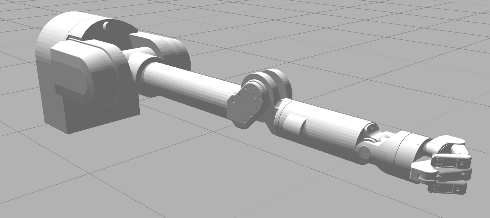
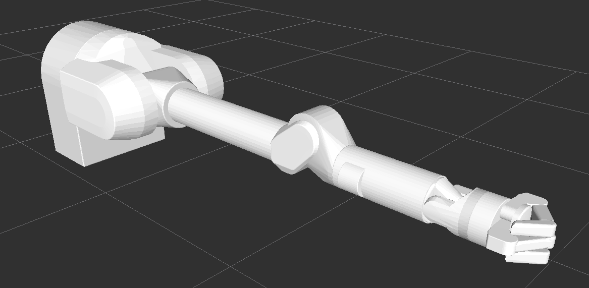

Barrett Model
=============

This repository contains Barrett WAM & BHand-280 CAD and modular URDFs with inertial properties.

The meshes and kinematics are based on publicly available resources from barrett.com. The dynamic properties are based on guidance from barrett.com as well as experiences with a real WAM and BH8-280.

## Visual

These are based on meshes exported directly from SolidWorks.



## Collision Meshes

The meshes used for collsion are sets of convex meshes processed manually in Blender to capture important surfaces and geometry.




### Joint Naming Conventions

* macro: `wam_7dof`
    * macro: `wam`
        * `PREFIX/base_yaw_joint`
        * `PREFIX/shoulder_pitch_joint`
        * `PREFIX/shoulder_yaw_joint`
        * `PREFIX/elbow_pitch_joint`
    * macro: `wam_wrist`
        * `PREFIX/wrist_yaw_joint`
        * `PREFIX/wrist_pitch_joint`
        * `PREFIX/palm_yaw_joint`

* macro: `bhand`
  * `PREFIX/finger_1/prox_joint`
  * `PREFIX/finger_1/med_joint`
  * `PREFIX/finger_1/dist_joint`
  * `PREFIX/finger_2/prox_joint`
  * `PREFIX/finger_2/med_joint`
  * `PREFIX/finger_2/dist_joint`
  * `PREFIX/finger_3/med_joint`
  * `PREFIX/finger_3/dist_joint`

### Examples

To create a 7-DOF WAM with a Barrett Hand:

```xml
<xacro:wam_7dof 
  prefix="wam_left" 
  parent_link="bench_link" 
  xyz="0.02 0.46 1" rpy="${PI} ${-PI/2} 0"/>
<xacro:bhand 
  prefix="wam_left/bhand" 
  parent_link="wam_left/wrist_palm_link" 
  xyz="0 0 0.06" rpy="0 0 0"/>
```

The easiest way to view the robot models is with the `urdf_tutorial` package:

```
roslaunch urdf_tutorial xacrodisplay.launch model:=robots/wam7_bhand.urdf.xacro gui:=true
```
